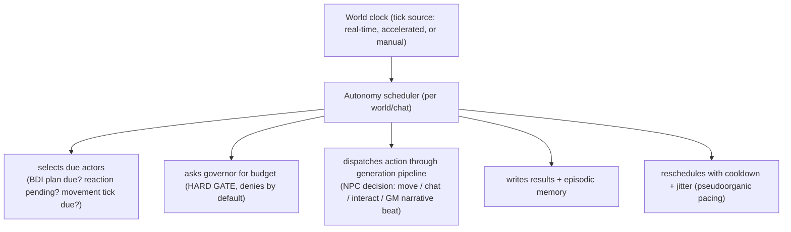

<!-- SPDX-License-Identifier: LGPL-3.0-or-later -->
<!-- SPDX-FileCopyrightText: 2026 Loop Lore Contributors -->

# EPIC: Actor Autonomy & Story Auto-Drive

**Overview:** (see sections below)

**Status:** In Progress
**Priority:** High
**Effort:** Large
**Type:** Feature Epic
**Tags:** autonomy, npc, actors, story-drive, simulation, rate-limiting, scheduler, bdi
**Related:** epic-agency-story-points.md (BDI loop host), epic-character-internal-traits.md (D9 autonomy preferences consumed by the governor), epic-npc-navigation.md (movement executor), epic-assistant-gm-flows.md (GM roles + AI director), epic-npcs.md, epic-world-travel-time.md (world clock)

## Summary

Own the **autonomy loop**: the scheduler and governance layer that lets LLM characters,
GMs, and NPCs act, explore, and interact *without a human driving every turn* —
pseudoorganic story development. This epic is the orchestrator and the budget holder;
decision intelligence (BDI, reactions) and action execution (navigation, social, combat)
stay in their host epics.

**Highest-priority principle: rate-limited by default.** Every autonomous action
consumes LLM calls (money, tokens, DB writes). The governor is not a feature of the
loop — it precedes it. No autonomous action path ships ungoverned. An unlimited mode
exists solely for headless stress-testing and is explicitly gated.

## Current State

- Movement execution exists and is now autonomously driven: `NpcNavigationService`
  (`src/rpg/npc-navigation/`) is called by the scheduler through
  `src/rpg/npc-navigation/tick-driver.ts` (`runNpcMovementTick`) — jittered and gated on
  the governor's `perUserCap`.
- The orchestrator exists: `AutonomyScheduler` (`src/autonomy/scheduler/`) owns the world-tick
  loop, due-world selection, pause/resume/step, per-world cursor persistence, and telemetry.
- Governance exists: `AutonomyGovernor` (`src/autonomy/governor/`) charges per-agent and
  per-user budgets from the `autonomy_budget` table and denies by default.
- Configuration is layered and writable: `resolveAutonomyConfig` (per-actor → per-chat →
  per-world → preset) with write routes for all three layers and an Autonomy tab plus chat
  settings modal for the UI.
- Still outstanding: BDI-decision and GM-beat dispatch from the tick loop. Both need the
  decision layer from `epic-agency-story-points.md`, which is planned but not built. Until
  it lands, the scheduler dispatches movement ticks only.
- GM orchestration remains reactive: `GameMasterService` generates on user turns only;
  `GameMasterConfig.type: llm|human|hybrid` + per-actor model routing exist.
- Group-chat cascade has max-turns / consecutive-turn guards — chat-scoped, not world-scoped,
  and the scheduler does not bypass them.
- Scope corrected 2026-10-02. This epic was holding ten tickets in
  `.plan/feature-matrix.md`, five of which it never wanted: two were duplicates of
  Done work already listed above (now **Wontfix**), and three were greenfield
  tickets naming symbols absent from `src/`, re-pointed at `epic-party-migration`,
  `epic-world-locations` and `epic-workflow-engine`. See the "Re-filed out of this
  epic" table under Linked Tickets. The epic's real open work is the three
  remaining rows: BDI plan recompute, GM beat scheduling, and deterministic turns.
- The scheduler's dispatch seam is the extension point for other subsystems: the
  `AutonomyScheduler` constructor takes `opts.dispatch` — an
  `AutonomyDispatch[]` appended after the built-in movement target, which always
  runs so a new target can never silently stop NPCs moving
  (`AutonomyScheduler` ctor, `this.#dispatchTargets = [movementDispatch, ...]` in
  `src/autonomy/scheduler/index.ts`). Party travel, discovery/trade events
  and any future world-simulation step are meant to arrive as targets through that
  array, not as scope inside this epic. Each target owns its own gating and
  governor charge.

## Architecture

Key decisions:

1. **Tick source is pluggable** — real-time (background), accelerated (N game-hours per
   real minute), manual (user presses "advance world"); UI never blocks on the loop.
2. **Governor denies by default.** Autonomy is opt-in per world/chat, never ambient.
3. **Jitter is mandatory** — fixed-interval actor actions read as robotic; every
   cooldown gets randomized spread (configurable spread ratio).
4. **Human-in-loop is a mode, not an obstacle** — pause/resume/step-one-action at any
   point; group-cascade guards are reused, not reimplemented.
5. **LLM GM is just another governed actor** — narrative beats consume the same budget;
   hybrid GM (human + LLM suggestions) shares the queue.

## Work Items

- [x] **Story auto-drive scheduler** — world-tick loop, due-actor selection, action dispatch through existing generation pipeline (navigation ticks, BDI decisions, GM beats), pause/resume/step, persistence of simulation state across restarts. → TASK-story-auto-drive-scheduler
- [x] **NPC navigation tick driver** — autonomous caller for `NpcNavigationService` ticks via the scheduler, with jitter and governor budget gate. → `TASK-world-simulation-npc-navigation-tick-driver.md`
- [x] **Autonomy config surface** — layering: world default → chat override → per-actor override; pacing presets (serene / organic / brisk); unlimited stress preset gated to dev builds; UI affordances in chat + world settings. → TASK-autonomy-config-surface

## Non-Goals

- Decision intelligence itself (BDI/reactions — `epic-agency-story-points.md`)
- Movement/pathfinding internals (`epic-npc-navigation.md`)
- AI director tension/arc scoring (`epic-assistant-gm-flows.md`)
- HTTP transport rate limiting (auth/middleware — separate subsystem)

## Acceptance Criteria

- [ ] No code path allows an ungoverned autonomous LLM call; governor denial is the default and tested.
- [ ] Unlimited mode requires explicit dev/stress flag; flag off → limits enforced; flag on → every action cost-logged.
- [ ] Scheduler survives restart (simulation state persisted); pause/resume/step verified end-to-end.
- [ ] Pacing presets produce measurably different action cadence (jitter verified).

## Spec Alignment

- `docs/spec/autonomy-determinism.md` — authoritative determinism contract
  for this loop: seeded jitter on every cooldown/reschedule, replayable
  tick ordering; wall-clock randomness is a spec violation.
- `docs/spec/npc-navigation.md` — tick cadence the movement dispatch
  target executes under (`runNpcMovementTick` via `opts.dispatch`).
- `docs/spec/generation-scheduler.md` — complementary admission control:
  the provider scheduler gates generation capacity while the governor
  holds actor budgets; neither reimplements the other.

## Related

Host epics retain their scopes; this epic owns scheduling + governance only.

Generation-level regulation (holds, concurrency semaphore, request-rate limits) lives in
`epic-generation-flow-control.md`: the autonomy scheduler is a governed consumer of those
controls, and the governor stacks actor-level budgets on top — the layers do not reimplement each other.

The `autonomy_preferences` data schema (AutonomyProfile, D9) is owned by
`epic-character-internal-traits.md`; this epic consumes it at runtime and does not redefine it.

## Docs-Gap Audit Remainders (2026-09-19)

- [x] [gap-audit E15] Per-agent/user budget caps UI + cost dashboards — budget-remaining and reset-window UI shipped in the world Autonomy tab and the chat settings modal via `TASK-autonomy-rate-governor`

## Linked Tickets (Concrete Implementation)

| Work Item | Ticket | On-disk | Status |
| --------- | ------ | ------- | ------ |
| Story auto-drive scheduler | `TASK-story-auto-drive-scheduler.md` | yes | Done — loop, selection, dispatch via `runNpcMovementTick`, controls, persistence, telemetry all ship. BDI + GM dispatch split out: `TASK-bdi-plan-recompute-implementation`, `TASK-gm-beat-scheduling` |
| BDI plan recompute implementation | `TASK-bdi-plan-recompute-implementation.md` | yes | open — `planRecompute` has no production impl; blocks BDI dispatch |
| GM beat scheduling | `TASK-gm-beat-scheduling.md` | yes | open — GM is turn-driven only; double-movement + chat-vs-world blockers |
| NPC navigation tick driver | `TASK-world-simulation-npc-navigation-tick-driver.md` | yes | Done — `src/rpg/npc-navigation/tick-driver.ts` (`runNpcMovementTick`) is the scheduler's caller; jitter + `perUserCap` governor gate |
| Autonomy config surface | `TASK-autonomy-config-surface.md` | yes | Done — layered resolver, presets, world/chat/per-actor write routes, Autonomy tab + chat settings modal |
| Per-agent/user budget caps UI (gap-audit E15) | `TASK-autonomy-rate-governor.md` | yes | Done — `AutonomyGovernor.tryConsume` + budget-remaining and reset-window UI in both settings surfaces |
| Config layering / presets / overrides (dup) | `TASK-autonomy-config-surface-layering-presets-and-overrides.md` | yes | Wontfix — duplicate of `TASK-autonomy-config-surface.md` (Done); all four ACs met and tested |
| Rate governor for LLM actors (dup) | `TASK-autonomy-rate-governor-for-llm-actors.md` | yes | Wontfix — duplicate of `TASK-autonomy-rate-governor.md` (Done); cost ledger + global kill switch still unmet, filed forward as `TASK-autonomy-cost-ledger-kill-switch.md` (open) |
| Per-actor cost ledger + global kill switch | `TASK-autonomy-cost-ledger-kill-switch.md` | yes | open — per-actor cost ledger + global kill switch (open ACs from autonomy governor duplicate) |

All referenced tickets are filed on disk. The scheduler's BDI and GM dispatch work was split into the two follow-up tickets above after scoping found neither had a callable, non-greenfield entry point. The 2026-09-23 gap-audit was stale — this table supersedes it.

### Re-filed out of this epic (2026-10-02)

Five tickets that carried `**Epic:** epic-actor-autonomy-story-drive` were audited
against `src/`. Three named symbols that do not exist anywhere in the codebase, so
they were re-pointed at the epics whose scopes actually claim that work:

| Ticket | Was | Now | Why |
| ------ | --- | --- | --- |
| `TASK-world-simulation-timeline-driven-travel-patrol.md` | this epic | `epic-party-migration` | `advancePartyTravel` / `migrateNpc` are greenfield; party travel, patrol routes and world-tick integration are named in that epic's Scope, which already binds `TASK-party-schedule-and-patrol-routes` |
| `TASK-world-simulation-discovery-and-trade-events.md` | this epic | `epic-world-locations` | `discover_progress` / `trade:route` / `location:discovered` are greenfield; `world_events` is a per-GM-turn JSON column on `story_turns`, not a table |
| `TASK-workflow-dag-engine-task-dependencies.md` | this epic | `epic-workflow-engine` | `task_dependencies` is greenfield; a generic task DAG is not autonomy-loop work and `epic-cron-scheduler` (Done) scoped it out. **Contested** — the 2026-09-19 gap audit (line 148) deliberately parked agentic remainders in this epic; see the ticket's `## Filing note` for why this one is treated differently and how to revert |

Two more were near-duplicates of Done work already in this epic and are now
**Wontfix** with a `## Duplicate of` section naming the surviving ticket: the
config-surface layering ticket (dup of `TASK-autonomy-config-surface.md`) and the
LLM-actor rate-governor ticket (dup of `TASK-autonomy-rate-governor.md`). The two
ACs the governor duplicate never met — a per-actor cost ledger and the global
kill switch — are recorded as still open on that ticket rather than checked off,
and belong in a fresh ticket.

The two remaining open tickets in this table (BDI plan recompute, GM beat
scheduling) are unchanged and still Not Started: they are real autonomy-loop work
being implemented on this branch.
