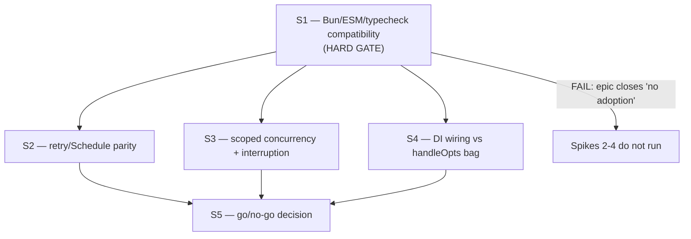

<!-- SPDX-License-Identifier: Apache-2.0 -->
<!-- SPDX-FileCopyrightText: 2026 Loop Lore Contributors -->

# Epic: Effect v4 Adoption Evaluation

**Overview:** (see sections below)

**Status:** Not Started
**Status Note:** Not Started
**Priority:** Medium
**Effort:** Medium
**Type:** Infrastructure Epic
**Tags:** effect, typescript, fp, typed-errors, retry, concurrency, dependency-injection, observability, evaluation

## Summary

Evaluate — with measurements, not enthusiasm — whether loop-lore should adopt
the [Effect](https://effect.website/docs/v4/onboarding) TypeScript library, and
adopt it **only per-surface** where a spike proves it is a net win.

This is an **evaluation epic, not a migration epic.** It ships four bounded
spikes and one decision ticket. The "no" outcome is a complete, valid, and
fully-recorded outcome that closes the epic.

## Why this epic exists

Effect's pitch is that a program's failure modes, dependencies, and lifecycle
should be visible to the compiler. loop-lore already hand-rolls a large part
of that promise:

- **seven** independent exponential-backoff implementations, three of them byte-identical
- a circuit breaker + provider failover
- a concurrency semaphore
- a structured logger with child loggers and bindings
- a config schema with env overrides and secret redaction
- ad-hoc `try/finally` resource cleanup
- `{ ok: false, error }` discriminated unions

So the adoption question is *not* "do we want typed errors" — the answer is
mostly already yes, in the local idiom. The question is narrow: **does Effect
replace something we currently pay for, at a cost we can afford?** Three
specific costs are on the table: the triplicated backoff math, the manual
wiring bag, and the absence of request/operation spans.

## Critical constraint: v4 is not released

Verified against the npm registry (2026-09-26):

| Fact | Value |
| ---- | ----- |
| `latest` dist-tag | `3.22.2` |
| v4 line dist-tag | `rc` → `4.0.0-rc.117` |
| v4 beta dist-tag | `4.0.0-beta.107` |
| v4 package shape | ESM-only (`"type": "module"`, no `engines` field declared) |
| v4 ecosystem modules | exported under `./unstable/*` (`unstable/sql`, `unstable/schema`, `unstable/http`, `unstable/cluster`, `unstable/ai`, …) |

**Consequence:** the v4 line we would be adopting is a release candidate whose
ecosystem surface is still explicitly unstable. Any adoption decision must
account for churn, and must never gate a load-bearing path (validation, HTTP,
DB access, config) on an RC dependency. This constraint is the reason the
compatibility spike is a hard gate and runs first.

## v4 API actuality (probed 2026-09-26)

A throwaway probe ran against `effect@4.0.0-rc.117` under Bun 1.4.2, in an
isolated `.tmp/effect-probe/` package. It records what is actually true of v4
today so the spikes do not spend their time rediscovering it. **The v4 API is
not the v3 API** — several v3 names are gone, and the repo's own typechecker
rejects them at compile time.

| Name | v4 reality | Consequence |
| ---- | ---------- | ----------- |
| `Effect.fork` | `undefined` (removed) | Use `Effect.forkScoped` |
| `Context.Tag` | `undefined` (removed) | Use `Context.Service` |
| `Tag.asEffect()` | `undefined` — the `Service` class *is* the accessor; `.key` is a string | Calling it throws `TypeError` |
| `Effect.interrupt` | an `object` (namespace), not callable | Not a direct call site |
| `Effect.void` | an `object`, not a function | Cannot be used as a pipe operator |
| `Effect.zipRight` | `undefined` (removed) | Use `Effect.andThen` |
| `Effect.forkScoped`, `Effect.withSpan`, `Effect.all`, `Effect.runPromise`, `Schedule.exponential` / `recurs` / `spaced` / `jittered`, `Layer`, `Context.Service` | all present | — |

Two behavioural findings that change how a harness must be written:

1. **`Effect.runSync` cannot run a delayed retry.** Over
   `Effect.retry(Schedule.exponential(...))` it throws
   `AsyncFiberError: An asynchronous Effect was executed with Effect.runSync`.
   The delay-free `Schedule.recurs(3)` form — which is what the v4 docs use in
   their own `runSync` examples — does work. **Any backoff parity harness must
   use `Effect.runPromise`.** Probed: `runPromise` + a delayed schedule
   resolved after 3 attempts in ~15 ms.
2. **`forkScoped` is not fire-and-forget, and silently skips cleanup if the
   scope exits first.** Measured with `Effect.acquireRelease`:

   | Scenario | Finalizers run |
   | -------- | -------------- |
   | fork, scope exits immediately | **0** — cleanup silently skipped |
   | fork, fiber runs, then scope exits | 1 |
   | interrupt a 10 s fiber via scope exit | 1, in ~21 ms |

   Interruption is real and fast. But a naive "fork and let the scope close"
   migration can drop a release that never ran. S3 must test for that case
   explicitly — it is the counter-risk to the pillar's whole premise.

Not verified by the probe: whether the package typechecks cleanly under the
repo's own tsgo strict config with `skipLibCheck` still off. That is exactly
what S1 measures, and remains open.

## Pillar-by-pillar assessment (verified 2026-09-26)

Effect's onboarding page advertises ten out-of-the-box capabilities. Assessed
against what loop-lore actually ships:

| Effect pillar | loop-lore today | Verdict |
| ------------- | ---------------- | ------- |
| Typed errors | Ad-hoc `{ ok: false, error }` unions, scoped to a few modules (e.g. `src/generation/image-engine/types.ts`, `src/chat/service/ownership.ts:141`) | **Low value.** The shape exists; Effect would add ceremony, not capability. |
| Retries & scheduling | **Seven** exponential-backoff implementations. Four are server-side retry loops, and three are **byte-identical**: `src/generation/providers/anthropic/http.ts:133`, `src/generation/providers/ollama-native/http.ts:180`, `src/generation/providers/openai-compatible/http.ts:206` all read `Math.min(1000 * 2 ** attempt, 10_000,)`; `src/utils/safe-fetch/retry.ts:42` repeats it with a configurable base. The other three are *not* retry policies: a breaker cooldown (`src/generation/providers/circuit-breaker.ts:134`), a message-cadence scheduler (`src/chat/proactive/timing.ts:59`), a browser reconnect backoff (`src/frontend/alpine/tunnel-protocol.ts:43`). | **Real duplication, and worse than "some".** Copy-paste triplication of one expression across three providers is a live maintenance hazard, not a style preference. Spike it. `call-with-failover.ts` does *failover*, not backoff math — adjacent, not a duplicate. |
| Structured concurrency | `src/llm/concurrency-limiter.ts` (async semaphore) | **Worth a spike.** The semaphore is ~125 lines; scoped interruption is genuinely absent. |
| Resource safety | Ad-hoc `try/finally` (e.g. `src/async/offload.ts`) | **Low-medium.** Improvement is real but bounded and rarely reached. |
| Dependency injection | `RegisterPluginsOpts` (`src/app/register-plugins.ts:110-115`) — a 3-field bag `{ database, config, asyncStore }` threaded into ~100 route factories and registered onto `Elysia<any>` (`register-plugins.ts:124`). The repo *chose* this: `src/elysia-app.ts:14-15` says it "Uses closure injection (not .state()/.decorate()) to avoid Elysia's complex type inference issues when merging plugins." | **Real, and not redundant.** Elysia's own DI mechanism was rejected here for type-inference reasons, so a type-checked service layer is a genuine alternative, not a duplicate container. Spike it. |
| Observability (spans) | `src/logger` with `child()` + bindings; `/metrics` Prometheus exposition in `src/routes/metrics.ts`; **no span concept in any `src/**/*.ts`** (grepped `withSpan`, `startSpan`, `tracing`, `otel`; only near-miss is `src/logger/types.ts:34`, a `requestId?: string` commented "Request ID for tracing") | **Genuinely missing — but Effect is probably the wrong fix.** The cheap answer is the OpenTelemetry API composed onto the existing logger, and that evaluation already exists (see *Related*, not duplicated here). |
| Streaming | — | **Skip.** No proven need. |
| Schema validation | Elysia `t` (TypeBox) in `src/validation/schemas.ts`, plus Kysely-generated DB schemas | **Never.** TypeBox is load-bearing for Elysia request validation; swapping it is a rewrite with no offsetting gain. |
| Configuration | `ConfigSchema` + `applyEnvironmentOverrides` (`src/config/load/env.ts`) + secret redaction (`src/admin/config-keys.ts`) | **Skip.** Already done, and it is a domain-specific schema, not an env reader. |
| HTTP / framework | Elysia | **Never.** Elysia is the framework. |

**Net read:** two of ten pillars justify a spike (retries, concurrency), one is
genuinely missing but has a cheaper fix (spans), two are structurally off-limits
(schema, HTTP), and the rest are already covered. Effect is a plausible
**per-surface library**, not a plausible framework for this codebase.

## Scope

- Four bounded spikes (compatibility, retry parity, scoped concurrency, DI wiring)
- One go/no-go decision ticket with measured numbers
- An explicit, recorded position on every pillar above, including the four skipped ones

## Non-goals

- **No rewrite.** loop-lore does not migrate to Effect as its application framework.
- **No replacement of Elysia, TypeBox, Kysely, or `src/logger`.**
- **No new runtime dependency until the compatibility spike passes.** Spikes run in a throwaway `.tmp/` harness or a scratch branch; nothing lands in `package.json` until a "go" is recorded.
- **No duplication of the OpenTelemetry evaluation** — see *Related epics and tickets*.

## Design

### Spike shape

Every spike follows the same shape so results are comparable:

1. Pick **one** real call path, not a toy.
2. Build the Effect version beside the current version in `.tmp/` (scratch, never committed).
3. Measure: net LOC delta, wall-clock latency on the happy path, and behaviour parity on the failure path.
4. Record the numbers in the epic's *Spike Results* table. No number, no adoption.

### Decision gate

The decision ticket takes each pillar and records exactly one of:

- `ADOPT` — Effect is a measured net win on that surface; a follow-up epic scopes the migration.
- `ADOPT-SUBSET` — a single operator (e.g. `Schedule`) is worth importing without the Effect type.
- `REJECT` — Effect loses to the status quo or to a cheaper alternative; record which one shipped instead.

The default expectation, recorded up front, is **mostly reject**. The spikes exist
to overturn that expectation with evidence, not to confirm it.

## Spikes and gate order

S1 is a hard gate: if `effect` cannot install, import, and typecheck under Bun +
tsgo strict without regressing a `bun run check` gate, the epic closes as
"no adoption" and S2–S4 never run.

## Tasks

- [ ] S1 — Bun/ESM/typecheck compatibility spike (hard gate)
- [ ] S2 — retry/Schedule parity spike on the provider call path
- [ ] S3 — scoped concurrency and interruption spike
- [ ] S4 — DI wiring spike versus the `handleOpts` bag
- [ ] S5 — go/no-go adoption decision

## Spike Results

Empty until the spikes run. Populate with measured numbers, not adjectives.

| Spike | Metric | Current | With Effect | Delta | Verdict |
| ----- | ------ | ------- | ----------- | ----- | ------- |
| S1 | typecheck + gate pass | — | — | — | — |
| S2 | LOC, happy-path latency, failover parity | — | — | — | — |
| S3 | LOC, cleanup correctness under interruption | — | — | — | — |
| S4 | LOC, `app:any` escapes removed, typecheck depth | — | — | — | — |

## Dependencies

- Independent of every other epic; shares no schema, no migration, no route surface.
- Read-only inputs: `src/generation/providers/*`, `src/llm/concurrency-limiter.ts`, `src/app/register-plugins.ts`, `src/logger/*`.
- The tracing gap is deliberately **not** addressed here — see *Related epics and tickets*.

## Related epics and tickets

| Item | Relationship |
| ---- | ------------ |
| `TASK-evaluate-elysia-opentelemetry.md` | Covers the tracing gap with the cheaper OTel answer. **Not duplicated by this epic.** |
| `TASK-evaluate-elysiajs-opentelemetry-versus-custom-telemetry-modu.md` | Same. Both are thin placeholders that predate this epic; S5 should fold their outcome in rather than re-run it. |
| `epic-observability-telemetry.md`, `epic-api-telemetry.md` | Own the observability surface; this epic only notes that spans are missing. |
| `BUG-v1-route-chain-exceeds-ts-instantiation-depth.md` | Closed by a workaround (split the `.use()` chain). S4 tests whether a service layer removes the underlying cause. |
| `epic-error-envelope.md`, `epic-logging.md` | Adjacent error/logging surfaces; this epic proposes no change to them. |
| `epic-concurrency-runtime-benchmarks.md` | S3's benchmark harness may already exist there — reuse it rather than building a second one. |

## Files

- `.plan/tickets/TASK-effect-v4-bun-esm-typecheck-compatibility-spike.md`
- `.plan/tickets/TASK-effect-v4-retry-schedule-parity-spike-on-the-provider-call-p.md`
- `.plan/tickets/TASK-effect-v4-scoped-concurrency-and-interruption-spike.md`
- `.plan/tickets/TASK-effect-v4-di-wiring-spike-versus-the-handleopts-bag.md`
- `.plan/tickets/TASK-effect-v4-go-no-go-adoption-decision.md`

(No `src/` files. An evaluation epic ships no code.)

## Notes

- Adopting an RC dependency is the single biggest risk in this epic. S1 exists
  specifically to price that risk before anything else is measured.
- The v4 docs themselves advocate the Effect LSP plugin on `tsgo` for agentic
  workflows. That is a separate, independently-evaluable question and is
  **not** part of this epic.
- If the decision is "no", the correct outcome is: record it, keep the numbers,
  and close. Do not leave a half-migrated codebase as a legacy.
