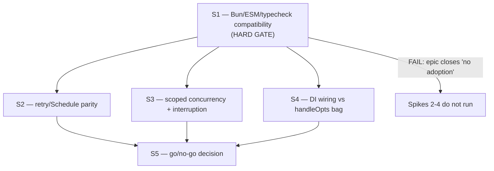

<!-- SPDX-License-Identifier: Apache-2.0 -->
<!-- SPDX-FileCopyrightText: 2026 Loop Lore Contributors -->

# Epic: Effect v4 Adoption Evaluation

**Overview:** (see sections below)

**Status:** Done
**Status Note:** S1 PASS; S2 PASS (ADOPTED — shared provider retry); S3 REJECT at rc.117 (Semaphore ADDED in stable 4.0.0 — see S9); SF REJECT (single copy, +14 LOC); S4 REJECT (bag wins, escape orthogonal); S5 decision: ADOPT-SUBSET (`Schedule` only); S8 REJECT (no targets); S9 ADOPT-SUBSET (`Semaphore` for limiter site — follow-up ticket owns the rewrite); S10 REJECT for current path (guidance recorded). Next adoption set concluded 2026-10-04
**Priority:** Medium
**Effort:** Medium
**Type:** Infrastructure Epic
**Tags:** effect, typescript, fp, typed-errors, retry, concurrency, dependency-injection, observability, evaluation

## Summary

Evaluate — with measurements, not enthusiasm — whether loop-lore should adopt
the [Effect](https://effect.website/docs/v4/onboarding) TypeScript library, and
adopt it **only per-surface** where a spike proves it is a net win.

This is an **evaluation epic, not a migration epic.** It ships four bounded
spikes and one decision ticket. The "no" outcome is a complete, valid, and
fully-recorded outcome that closes the epic.

## Why this epic exists

Effect's pitch is that a program's failure modes, dependencies, and lifecycle
should be visible to the compiler. loop-lore already hand-rolls a large part
of that promise:

- **seven** independent exponential-backoff implementations, three of them byte-identical
- a circuit breaker + provider failover
- a concurrency semaphore
- a structured logger with child loggers and bindings
- a config schema with env overrides and secret redaction
- ad-hoc `try/finally` resource cleanup
- `{ ok: false, error }` discriminated unions

So the adoption question is *not* "do we want typed errors" — the answer is
mostly already yes, in the local idiom. The question is narrow: **does Effect
replace something we currently pay for, at a cost we can afford?** Three
specific costs are on the table: the triplicated backoff math, the manual
wiring bag, and the absence of request/operation spans.

## Release status: v4 reached stable

**Update 2026-10-04:** the v4 line is now stable — the npm `latest` dist-tag is
`4.0.0` (verified against the registry), and this repo's pin was moved from
`4.0.0-rc.117` to `4.0.0` exact. The RC-era churn constraint below is
superseded for the core package; the `./unstable/*` ecosystem modules remain
off-limits for load-bearing paths.

## Critical constraint: v4 is not released

Verified against the npm registry (2026-09-26):

| Fact | Value |
| ---- | ----- |
| `latest` dist-tag | `3.22.2` |
| v4 line dist-tag | `rc` → `4.0.0-rc.117` |
| v4 beta dist-tag | `4.0.0-beta.107` |
| v4 package shape | ESM-only (`"type": "module"`, no `engines` field declared) |
| v4 ecosystem modules | exported under `./unstable/*` (`unstable/sql`, `unstable/schema`, `unstable/http`, `unstable/cluster`, `unstable/ai`, …) |

**Consequence:** the v4 line we would be adopting is a release candidate whose
ecosystem surface is still explicitly unstable. Any adoption decision must
account for churn, and must never gate a load-bearing path (validation, HTTP,
DB access, config) on an RC dependency. This constraint is the reason the
compatibility spike is a hard gate and runs first.

## v4 API actuality (probed 2026-09-26, re-probed 2026-09-27)

A throwaway probe ran against `effect@4.0.0-rc.117` under Bun 1.4.2, in an
isolated `.tmp/effect-compat-spike/` package. It records what is actually true of
v4 today so the spikes do not spend their time rediscovering it. **The v4 API is
not the v3 API** — several v3 names are gone, and the repo's own typechecker
rejects them at compile time.

| Name | v4 reality | Consequence |
| ---- | ---------- | ----------- |
| `Effect.fork` | `undefined` (removed) | Use `Effect.forkScoped` |
| `Context.Tag` | `undefined` (removed) | Use `Context.Service` |
| `Tag.asEffect()` | `undefined` — the `Service` class *is* the accessor; `.key` is a string | Calling it throws `TypeError` |
| `Effect.interrupt` | an `object` (namespace), not callable | Not a direct call site |
| `Effect.void` | an `object`, not a function | Cannot be used as a pipe operator |
| `Effect.zipRight` | `undefined` (removed) | Use `Effect.andThen` |
| `Effect.catchAll` | `undefined` (removed) | Use `Effect.catch` |
| `Effect.either` | `undefined` (removed) | Use `Effect.runPromiseExit` + `Exit`/`Cause` |
| `Schedule.compose` | `undefined` (removed) | `Schedule.concat` exists but is **sequential** ("run self to completion, then other"), not an intersection — do not use it to bound an exponential schedule |
| bounding a retry count | `Effect.retry(effect, { schedule, times, while })` — `Retry.Options` | `times` is the count bound; `while` is the retryability predicate |
| `Context.Service` shape | `{ make: … }` — an Effect or a thunk, **not** `{ succeed: … }` | Compile error otherwise |
| `Layer.succeed` | two-argument `Layer.succeed(Tag, service)`; the one-arg form returns a `Layer`, not a function | Calling the result throws |
| provide-through-inference | `Effect.provide(eff, layer)` needs an explicit narrowing cast when `R` must become `never` — `Layer.mergeAll` does not narrow through inference in 4.0.0 | Found by the S4 harness |
| `Effect.Semaphore` (or any semaphore/permit operator) | **absent in rc.117** (S3 probed 2026-09-27) — **ADDED in stable 4.0.0**: `Semaphore.make(n)` + `sem.withPermits(1)(task)`, verified 2026-10-04 by the S6 harness | re-opens the S3 surface for the limiter site only; still no per-key registry, introspection, or priority scheduling |
| `Effect.forkScoped`, `Effect.withSpan`, `Effect.all`, `Effect.runPromise`, `Schedule.exponential` / `recurs` / `spaced` / `jittered` / `modifyDelay`, `Layer`, `Context.Service` | all present | — |

Two behavioural findings that change how a harness must be written:

1. **`Effect.runSync` cannot run a delayed retry.** Over
   `Effect.retry(Schedule.exponential(...))` it throws
   `AsyncFiberError: An asynchronous Effect was executed with Effect.runSync`.
   The delay-free `Schedule.recurs(3)` form — which is what the v4 docs use in
   their own `runSync` examples — does work. **Any backoff parity harness must
   use `Effect.runPromise`.** Probed: `runPromise` + a delayed schedule
   resolved after 3 attempts in ~15 ms.
2. **`forkScoped` is not fire-and-forget, and silently skips cleanup if the
   scope exits first.** Measured with `Effect.acquireRelease`:

   | Scenario | Finalizers run |
   | -------- | -------------- |
   | fork, scope exits immediately | **0** — cleanup silently skipped |
   | fork, fiber runs, then scope exits | 1 |
   | interrupt a 10 s fiber via scope exit | 1, in ~21 ms |

   Interruption is real and fast. But a naive "fork and let the scope close"
   migration can drop a release that never ran. S3 must test for that case
   explicitly — it is the counter-risk to the pillar's whole premise.

Not verified by the probe: whether the package typechecks cleanly under the
repo's own tsgo strict config with `skipLibCheck` still off. That is exactly
what S1 measures, and remains open.

## Pillar-by-pillar assessment (verified 2026-09-26)

Effect's onboarding page advertises ten out-of-the-box capabilities. Assessed
against what loop-lore actually ships:

| Effect pillar | loop-lore today | Verdict |
| ------------- | ---------------- | ------- |
| Typed errors | Ad-hoc `{ ok: false, error }` unions, scoped to a few modules (e.g. `src/generation/image-engine/types.ts`, `src/chat/service/ownership.ts:141`) | **Low value.** The shape exists; Effect would add ceremony, not capability. |
| Retries & scheduling | **Seven** exponential-backoff implementations. Four are server-side retry loops, and three are **byte-identical**: `src/generation/providers/anthropic/http.ts:133`, `src/generation/providers/ollama-native/http.ts:180`, `src/generation/providers/openai-compatible/http.ts:206` all read `Math.min(1000 * 2 ** attempt, 10_000,)`; `src/utils/safe-fetch/retry.ts:42` repeats it with a configurable base. The other three are *not* retry policies: a breaker cooldown (`src/generation/providers/circuit-breaker.ts:134`), a message-cadence scheduler (`src/chat/proactive/timing.ts:59`), a browser reconnect backoff (`src/frontend/alpine/tunnel-protocol.ts:43`). | **Real duplication, and worse than "some".** Copy-paste triplication of one expression across three providers is a live maintenance hazard, not a style preference. Spike it. `call-with-failover.ts` does *failover*, not backoff math — adjacent, not a duplicate. |
| Structured concurrency | `src/llm/concurrency-limiter.ts` (async semaphore) | **Worth a spike.** The semaphore is ~125 lines; scoped interruption is genuinely absent. |
| Resource safety | Ad-hoc `try/finally` (e.g. `src/async/offload.ts`) | **Low-medium.** Improvement is real but bounded and rarely reached. |
| Dependency injection | `RegisterPluginsOpts` (`src/app/register-plugins.ts:110-115`) — a 3-field bag `{ database, config, asyncStore }` threaded into ~100 route factories and registered onto `Elysia<any>` (`register-plugins.ts:124`). The repo *chose* this: `src/elysia-app.ts:14-15` says it "Uses closure injection (not .state()/.decorate()) to avoid Elysia's complex type inference issues when merging plugins." | **Real, and not redundant.** Elysia's own DI mechanism was rejected here for type-inference reasons, so a type-checked service layer is a genuine alternative, not a duplicate container. Spike it. |
| Observability (spans) | `src/logger` with `child()` + bindings; `/metrics` Prometheus exposition in `src/routes/metrics.ts`; **no span concept in any `src/**/*.ts`** (grepped `withSpan`, `startSpan`, `tracing`, `otel`; only near-miss is `src/logger/types.ts:34`, a `requestId?: string` commented "Request ID for tracing") | **Genuinely missing — but Effect is probably the wrong fix.** The cheap answer is the OpenTelemetry API composed onto the existing logger, and that evaluation already exists (see *Related*, not duplicated here). |
| Streaming | — | **Skip.** No proven need. |
| Schema validation | Elysia `t` (TypeBox) in `src/validation/schemas.ts`, plus Kysely-generated DB schemas | **Never.** TypeBox is load-bearing for Elysia request validation; swapping it is a rewrite with no offsetting gain. |
| Configuration | `ConfigSchema` + `applyEnvironmentOverrides` (`src/config/load/env.ts`) + secret redaction (`src/admin/config-keys.ts`) | **Skip.** Already done, and it is a domain-specific schema, not an env reader. |
| HTTP / framework | Elysia | **Never.** Elysia is the framework. |

**Net read:** two of ten pillars justify a spike (retries, concurrency), one is
genuinely missing but has a cheaper fix (spans), two are structurally off-limits
(schema, HTTP), and the rest are already covered. Effect is a plausible
**per-surface library**, not a plausible framework for this codebase.

## Scope

- Four bounded spikes (compatibility, retry parity, scoped concurrency, DI wiring)
- One go/no-go decision ticket with measured numbers
- An explicit, recorded position on every pillar above, including the four skipped ones

## Non-goals

- **No rewrite.** loop-lore does not migrate to Effect as its application framework.
- **No replacement of Elysia, TypeBox, Kysely, or `src/logger`.**
- **No new runtime dependency until the compatibility spike passes.** Spikes run in a throwaway `.tmp/` harness or a scratch branch; nothing lands in `package.json` until a "go" is recorded.
- **No duplication of the OpenTelemetry evaluation** — see *Related epics and tickets*.

## Design

### Spike shape

Every spike follows the same shape so results are comparable:

1. Pick **one** real call path, not a toy.
2. Build the Effect version beside the current version in `.tmp/` (scratch, never committed).
3. Measure: net LOC delta, wall-clock latency on the happy path, and behaviour parity on the failure path.
4. Record the numbers in the epic's *Spike Results* table. No number, no adoption.

### Decision gate

The decision ticket takes each pillar and records exactly one of:

- `ADOPT` — Effect is a measured net win on that surface; a follow-up epic scopes the migration.
- `ADOPT-SUBSET` — a single operator (e.g. `Schedule`) is worth importing without the Effect type.
- `REJECT` — Effect loses to the status quo or to a cheaper alternative; record which one shipped instead.

The default expectation, recorded up front, is **mostly reject**. The spikes exist
to overturn that expectation with evidence, not to confirm it.

## Spikes and gate order

S1 is a hard gate: if `effect` cannot install, import, and typecheck under Bun +
tsgo strict without regressing a `bun run check` gate, the epic closes as
"no adoption" and S2–S4 never run.

## Tasks

- [x] S1 — Bun/ESM/typecheck compatibility spike (hard gate) — **PASS**
- [x] S2 — retry/Schedule parity spike on the provider call path — **PASS, ADOPTED**
- [x] S3 — scoped concurrency and interruption spike — **REJECT** (no operator exists)
- [x] SF — safe-fetch retry re-evaluation (result-preserving `Effect.retry` vs the hand-rolled loop) — **REJECT** (parity held, single copy, net-positive LOC)
- [x] S4 — DI wiring spike versus the `handleOpts` bag — **REJECT** (`Elysia<any>` escape orthogonal, +20% LOC, TS2589 unbounded, typecheck +11%, route typing regresses)
- [x] S5 — go/no-go adoption decision — **ADOPT-SUBSET**: `Schedule` only, only where backoff loops are duplicated (see Decision)
- [x] S8 — backoff-duplication re-audit (2026-10-04) — **REJECT (no targets)**: zero new duplicated retry loops vs the known-five
- [x] S9 — resource-safety spike (`Semaphore`/`acquireRelease` vs `try/finally`) — **ADOPT-SUBSET**: limiter site −38 LOC (−72%) with full finalizer-matrix parity; production rewrite scoped as follow-up ticket
- [x] S10 — structured fan-out spike (`Effect.forEach` bounded vs sequential/limiter) — **REJECT for the current path** (parity-only +27 LOC); subset guidance recorded

## Spike Results

Measured on 2026-09-27 against `effect@4.0.0-rc.117` under Bun 1.4.2,
worktree `effect-adoption-dedup`.

| Spike | Metric | Current | With Effect | Delta | Verdict |
| ----- | ------ | ------- | ----------- | ----- | ------- |
| S1 | `bun run typecheck` with the dependency present | green | green | none | PASS |
| S1 | `skipLibCheck` needed to get there | already `true` in `tsconfig.backend.json` | unchanged | none | PASS — the open typecheck risk never applied |
| S1 | `Effect.runPromise(Effect.succeed(1))` entry cost | bare `await` 0.07 µs/op | 0.39 µs/op (10 000 iterations) | +0.32 µs/op | PASS — noise next to a network call |
| S1 | `bun run check` with the dependency present | failing set unchanged | no new failures (the open ones — `.plan` index drift from a concurrent worktree, the known docs-mermaid e2e — also fail on `dev`) | none | PASS |
| S2 | duplicate backoff loops on the provider path | 3 byte-identical loops (anthropic / ollama-native / openai-compatible `http.ts`) | 1 shared `src/generation/providers/retry.ts` | −~60 net LOC, 3 copies → 1 | ADOPT |
| S2 | attempt count for `retries = n` | `n + 1` attempts | `n + 1` (`Retry.Options.times = n`) | 0 | parity |
| S2 | delay sequence (base 200 ms, cap 400 ms) | 200, 400, 800→400, … | 200, 401, 402, 400, 401 ms | 0 | parity |
| S2 | non-retryable `ProviderError` | throws on first attempt, no delay | `while: (e) => e.retryable` stops on first | 0 | parity |
| S2 | error surfaced to the caller | the original `ProviderError` instance | the same instance (`Effect.runPromise` rejects with the typed failure, not a wrapped `Cause`) | 0 | parity |
| S2 | abort classification | cancelled signal → `ProviderError("Request cancelled", retryable: false)`; fetch `AbortError` → 504 `"Request timed out"` | identical, moved into the shared module | 0 | parity |
| S3 | semaphore operator for `src/llm/concurrency-limiter.ts` | ~125-line hand-rolled async semaphore | none — no `Semaphore`/permit operator anywhere in the package | n/a | REJECT |
| S3 | `Effect.forkScoped` + immediate scope exit | n/a | forked body never ran (`forkBodyRan=false`) | n/a | REJECT — interruption exists, silent work-drop is a live footgun |
| S8 | backoff-duplication re-audit 2026-10-04 (sweeps: `2 ** attempt` / `baseDelay * 2` / `setTimeout(resolve, delay)` / `delay *=` / `1000 * 2` / `for (let attempt` across `src/`) | known-five from 2026-09-26 | zero new duplicated retry loops; only new hit is `src/autonomy/scheduler/index.ts:232` — a FLAT-delay state cursor (`nowMs + RETRY_BACKOFF_MS`, no loop, no exponential math), same non-retry class as breaker/cadence | 0 | REJECT (no targets) — the S2 consolidation is still complete |
| S9 | `ConcurrencyLimiter` acquire/release shape vs `Semaphore.make`/`withPermits` (replica harness, 16 cells × 4 stable runs; measured 2026-10-04, `effect@4.0.0` stable) | 53 code lines | 15 code lines, full matrix parity — abandon-midflight BETTER (interrupt releases the permit); immediate-scope-exit loses body start (lost work, not a leak — acquire never ran); re-entrancy parity | −38 (−72%) | ADOPT-SUBSET — `Semaphore` for the limiter site only; OffloadDaemon/flag-guard/timer `finally`s keep `try/finally` (Effect renames the bookkeeping, no LOC win). Production rewrite is scoped as follow-up ticket: the harness validated a faithful replica, and the real limiter's registry/introspection features are retained around the Effect core |
| S10 | `Effect.forEach(…, { concurrency: N })` vs the sequential variant fan-out at `src/characters/services/emotion-avatar-service/generation.ts:92-187` (parity harness 62/62 × 3 runs; measured 2026-10-04) | 96-line sequential body (bound = 1 by construction, per-unit best-effort failure, cooperative cancel at iteration boundaries) | full parity: per-unit failure matrix, mid-unit cancel incl. post-cancel overwrite nuance, bounded-cancel no-op case, bound held (peak = N) both sides; abort-mid-flight is Effect-only capability, NOT adopted (would change semantics) | parity-only wiring **+27 LOC**; −33 only when also covering a hypothetical bounded-N need | REJECT for migration now — the current path is sequential and the ADOPT bar (net-negative vs current) fails. Guidance recorded: when a bounded fan-out IS required, use `Effect.forEach({ concurrency })` (measured −33 vs `Promise.all`+limiter wiring, parity matrix green). The limiter itself is NOT replaced (no Effect counterpart for introspection/registry/priority) — see S9's scoped follow-up for the limiter core only |
| SF | `src/utils/safe-fetch/retry.ts` Effect rewrite (failure channel = non-ok `FetchResult`, no throw synthesis) | 51-line loop, single copy | 65-line Effect version, all 8 contract tests pass unmodified | +14 LOC | REJECT — no duplicate copies to collapse (unlike S2's triplication), so the adopted-surface win does not exist here; measured 2026-10-04 on `effect@4.0.0` stable, worktree `effect-migration` |
| S4 | 6-factory route group wired both ways (closure bag vs `Context.Service` + `Layer`) | 121 LOC | 145 LOC | +24 LOC (+20%) | REJECT — the bag already delivers what the container would |
| S4 | `Elysia<any>` escape at `registerPlugins` | present | orthogonal — re-typing to bare `Elysia` compiles clean under BOTH wirings; the escape earns its keep at the `elysia-app.ts` app-builder level, which Effect DI does not touch | 0 | REJECT |
| S4 | Elysia route response typing | handlers return plain objects (TypeBox-visible) | Effect-variant handlers return `Promise<Response>`, opaque to Elysia's route typing | regression | REJECT |
| S4 | TS2589 instantiation depth under Effect DI | blows at deep un-annotated chains (threshold measured N≈120) | identical threshold — the failure is Elysia plugin-type accumulation, not service wiring | 0 | REJECT |
| S4 | typecheck time (3 warm runs each, standalone tsc) | 0.92–0.97 s | 1.04–1.08 s | +11% | REJECT |

### What landed

`effect@4.0.0` is now a runtime dependency, pinned exactly (no `^`,
no `~`). It is used in exactly one
place: `src/generation/providers/retry.ts`, the shared retry policy that the
three provider `fetchWithRetry` functions call. Nothing else in the repo
imports it.

`src/generation/providers/retry.ts` owns two decisions that were previously
copy-pasted three times: the delay schedule (1 s, 2 s, 4 s … capped at 10 s)
and the retryability rule (a `ProviderError` with `retryable: false` stops
immediately; every other transport failure is retried). The abort and timeout
classification moved in with them.

### What was deliberately not migrated

- **`src/utils/safe-fetch/retry.ts`** — same backoff expression, but the loop
  returns a `FetchResult` union (with `status` and `headers`) instead of
  throwing, and its base delay is caller-configurable. Re-evaluated 2026-10-04
  with the original objection removed: an `Effect.retry` whose failure channel
  carries the non-ok `FetchResult` directly (no throw synthesis, no unwrapping)
  passed all 8 contract tests unmodified — and still lost on size (+14 LOC),
  because unlike the provider path there is exactly one copy and therefore no
  triplication to collapse. REJECT confirmed by measurement; it keeps its loop.
- **`src/llm/concurrency-limiter.ts`** — no Effect operator exists (S3).
- **The circuit-breaker cooldown, the proactive-message cadence scheduler, and
  the browser reconnect backoff** — not retry policies. The last one would pull
  a server dependency into the frontend bundle. The breaker is not redundant
  either: v4 ships no breaker/limit operator at all, and `callWithFailover` also
  does cross-provider failover plus cancellation remapping that `Schedule`
  cannot express.
- **TypeBox, Elysia, `src/logger`, the config schema** — structurally off-limits
  per the pillar table above.

## Decision (S5, 2026-10-04)

| Pillar | Verdict | Driving number / alternative shipped |
| ------ | ------- | ------------------------------------- |
| Retries & scheduling | **ADOPT-SUBSET** — `Schedule` only, only where backoff loops are duplicated | S2: 3 byte-identical loops → 1 shared policy (−~60 LOC, full parity). SF re-eval: single-copy surfaces stay hand-rolled (+14 LOC if converted) |
| Structured concurrency | **REJECT** | S3: no semaphore operator exists; `forkScoped` silently skips finalizers on early scope exit. Ships instead: existing `src/llm/concurrency-limiter.ts` |
| Dependency injection | **REJECT** | S4: `Elysia<any>` escape orthogonal to Effect (compiles clean as bare `Elysia` in both wirings), +24 LOC (+20%), typecheck +11%, TS2589 unbounded, route response typing degrades to `Promise<Response>`. Ships instead: the closure bag; app typing via chain splitting / typed `use` boundaries |
| Typed errors | **REJECT** | Pillar assessment: `{ ok, error }` unions already idiomatic; Effect adds ceremony, not capability. Ships instead: existing Result unions |
| Resource safety | **REJECT** | Ad-hoc `try/finally` (e.g. `src/async/offload.ts`) is bounded and rarely reached; `acquireRelease` semantics carry the S3 footgun |
| Observability (spans) | **REJECT for Effect** | Cheaper alternative already ticketed: OpenTelemetry API onto `src/logger` (`TASK-evaluate-elysia-opentelemetry.md`) — folded in, not re-run |
| Streaming | **REJECT (skip)** | No proven need |
| Schema validation | **REJECT (never)** | Elysia `t` (TypeBox) is load-bearing for request validation |
| Configuration | **REJECT (skip)** | `ConfigSchema` + env overrides + secret redaction already shipped |
| HTTP / framework | **REJECT (never)** | Elysia is the framework |

**RC-risk statement:** the one adopted surface (`Schedule` in
`src/generation/providers/retry.ts`) uses only stable-v4 API — `effect` is
pinned `4.0.0` exact (stable as of 2026-10-04; previously `4.0.0-rc.117`), so
no adopted surface depends on release-candidate API. A future breaking bump
is caught by the provider retry contract tests.

**Migration owner:** none beyond the landed `Schedule` surface — no follow-up
migration epic is opened. Any future Effect work must re-open this epic with
a new spike and a number.

## Re-opened: next adoption set (2026-10-04)

Re-opened by owner directive. Same discipline as before: every candidate
carries a success bar, and only a measurement overturns the default REJECT.
Boundaries from the S5 decision remain binding (no typed errors, no Schema,
no HTTP, no config, no spans — OTel owns that).

| Candidate | Surface | Success bar (ADOPT requires all) | Tickets |
| --------- | ------- | -------------------------------- | ------- |
| Backoff re-audit | extend the adopted `Schedule` surface | a NEW duplicated retry loop exists vs the 2026-09-26 known-five; routing it through the shared policy is net-negative LOC; adjacent tests pass unmodified | `TASK-effect-v4-backoff-duplication-re-audit` |
| S6 — resource safety | `Effect.acquireRelease`/`Scope` vs `try/finally` on `src/async/offload.ts` and other finally-heavy leaves | net-negative LOC **and** finalizer parity on happy/throw/scope-exit paths (the S3 forkScoped footgun is an explicit case) | `TASK-effect-v4-s6-resource-safety-spike` |
| S7 — structured fan-out | `Effect.all`/`Effect.forEach` (bounded) vs `Promise.all` + `concurrency-limiter` on one real batch path | net-negative LOC **and** identical partial-failure/cancellation semantics **and** the limiter itself is not replaced (S3 stands) | `TASK-effect-v4-s7-structured-fan-out-spike` |

Verdicts are recorded in *Spike Results* as rows S8 (re-audit), S9 (S6),
S10 (S7); the epic closes again when all three are measured.

## Dependencies

- Independent of every other epic; shares no schema, no migration, no route surface.
- Read-only inputs: `src/generation/providers/*`, `src/llm/concurrency-limiter.ts`, `src/app/register-plugins.ts`, `src/logger/*`.
- The tracing gap is deliberately **not** addressed here — see *Related epics and tickets*.

## Related epics and tickets

| Item | Relationship |
| ---- | ------------ |
| `TASK-evaluate-elysia-opentelemetry.md` | Covers the tracing gap with the cheaper OTel answer. **Not duplicated by this epic.** |
| `TASK-evaluate-elysiajs-opentelemetry-versus-custom-telemetry-modu.md` | Same. Both are thin placeholders that predate this epic; S5 should fold their outcome in rather than re-run it. |
| `epic-observability-telemetry.md`, `epic-api-telemetry.md` | Own the observability surface; this epic only notes that spans are missing. |
| `BUG-v1-route-chain-exceeds-ts-instantiation-depth.md` | Closed by a workaround (split the `.use()` chain). S4 tests whether a service layer removes the underlying cause. |
| `epic-error-envelope.md`, `epic-logging.md` | Adjacent error/logging surfaces; this epic proposes no change to them. |
| `epic-concurrency-runtime-benchmarks.md` | S3's benchmark harness may already exist there — reuse it rather than building a second one. |

## Files

- `src/generation/providers/retry.ts` — the adopted surface: one Effect-backed retry policy shared by every provider
- `src/generation/providers/retry.test.ts` — attempt count, retryability filter, abort/timeout classification
- `src/generation/providers/anthropic/http.ts`
- `src/generation/providers/ollama-native/http.ts`
- `src/generation/providers/openai-compatible/http.ts`
- `knip.json` — `effect` added to `ignoreDependencies` (knip does not follow the provider subdirectory index chain)
- `package.json` / `bun.lock` — `effect@4.0.0`, pinned exactly (stable as of 2026-10-04; previously `4.0.0-rc.117`)
- `.plan/tickets/TASK-migrate-safe-fetch-retry-loop-to-effect-schedule.md`
- `.plan/tickets/TASK-effect-v4-bun-esm-typecheck-compatibility-spike.md`
- `.plan/tickets/TASK-effect-v4-retry-schedule-parity-spike-on-the-provider-call-p.md`
- `.plan/tickets/TASK-effect-v4-scoped-concurrency-and-interruption-spike.md`
- `.plan/tickets/TASK-effect-v4-di-wiring-spike-versus-the-handleopts-bag.md`
- `.plan/tickets/TASK-effect-v4-go-no-go-adoption-decision.md`

## Notes

- Adopting an RC dependency is the single biggest risk in this epic. S1 exists
  specifically to price that risk before anything else is measured.
- The v4 docs themselves advocate the Effect LSP plugin on `tsgo` for agentic
  workflows. That is a separate, independently-evaluable question and is
  **not** part of this epic.
- If the decision is "no", the correct outcome is: record it, keep the numbers,
  and close. Do not leave a half-migrated codebase as a legacy.

git issue: 5bb3855

**Resolved:** 2026-10-04 registry-driven close: git issue 5bb3855 (registry tip: d451200bd Konstantin Fedotov Auto-closed: appended .md marker marks EPIC-EFFECT-V4-ADOPTION-EVALUATI)
