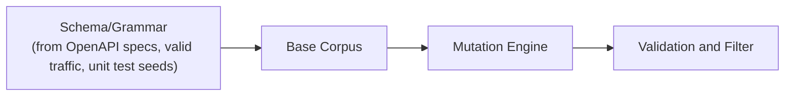

<!-- SPDX-License-Identifier: Apache-2.0 -->
<!-- SPDX-FileCopyrightText: 2026 Loop Lore Contributors -->

# EPIC: Fuzzing Infrastructure

**Overview:** (see sections below)


**Status:** In Progress
**Status Note:** Schema-driven generation ships: `scripts/generate-schema-fuzz.ts` scans TypeBox schema modules across `src/validation/schemas/` and `src/routes/` and emits the committed, seeded `src/validation/schema-fuzz.generated.test.ts` (`bun run fuzz:gen` / `fuzz:check`), built on the schema-to-arbitrary primitives in `src/test-utils/schema-arbitrary.ts`. That layer exercises valid inputs only. Not yet built: the harness runner, mutation engine, seed corpora, per-target harnesses, sanitizer integration, CI integration, and the continuous-fuzzing cluster — see Linked Tasks.
**Priority:** Medium
**Effort:** Medium
**Type:** Infrastructure Epic
**Tags:** fuzzing, security, testing, mutation
**Parent Epic:** Testing, Benchmarking & Performance (epic-testing-benchmarking.md)

## Overview

Systematic approach to generating diverse, malicious, and edge-case inputs for fuzzing all external interfaces, with harness runner, corpora, mutation engine, sanitizer integration, CI targets, and crash triage.

**Spec**: `docs/spec/fuzzing-input-generation.md`

## Sub-Epic of

Part of the **Testing, Benchmarking & Performance** epic. See parent epic for the shared pressure/fuzzing test tiers.

## Linked Tasks

| Task                                                             | Title                                                              | Priority | Status      |
| ---------------------------------------------------------------- | ------------------------------------------------------------------ | -------- | ----------- |
| TASK-fuzzing-infrastructure-harness-runner-corpus-manager-crash-d | Fuzzing infrastructure — harness runner, corpus manager, crash deduplicator | high     | Not Started |
| TASK-mutation-engine-bitflip-arithmetic-dictionary-structure-cros  | Mutation engine — bitflip, arithmetic, dictionary, structure, crossover, generative | high     | Not Started |
| TASK-per-target-fuzzing-harnesses-auth-asset-chat-llm-admin-ipc    | Per-target fuzzing harnesses — auth, asset, chat, llm, admin, IPC     | high     | Not Started |
| TASK-seed-corpora-10k-seeds-per-fuzzing-target                    | Seed corpora — 10k+ seeds per fuzzing target                        | medium   | Not Started |
| TASK-ci-integration-github-actions-matrix-artifact-upload-on-cras   | CI integration — GitHub Actions matrix + artifact upload on crash   | medium   | Not Started |
| TASK-continuous-fuzzing-cluster-scheduler-corpus-sync-crash-triag  | Continuous fuzzing cluster — scheduler, corpus sync, crash triage  | medium   | Not Started |
| TASK-dashboard-integration-coverage-crashes-corpus-performance-ro   | Dashboard integration — coverage, crashes, corpus, performance, ROI | low      | Not Started |
| TASK-sanitizer-integration-asan-msan-ubsan-tsan                    | Sanitizer integration — ASan, MSan, UBSan, TSan                     | low      | Not Started |
| TASK-regression-process-crash-classification-minimization-fix-ver   | Regression process — crash classification, minimization, fix verification | low      | Not Started |

## Input Categories

| Category                                    | Targets                                                       | Strategy                                                          | Priority |
| ------------------------------------------- | ------------------------------------------------------------- | ----------------------------------------------------------------- | -------- |
| Structured Data (JSON/MessagePack/Protobuf) | REST endpoints, WebSocket messages, IPC                       | Type-aware mutation, schema violation, encoding attacks           | P0       |
| Text/Protocol                               | Chat messages, LLM prompts, command parsers, regex extractors | Grammar-based fuzzing, injection payloads, unicode edge cases     | P0       |
| Binary/Asset                                | Image upload, audio/video, file metadata extraction           | Format corruption, polyglot files, ZIP bombs, decompression bombs | P0       |
| Network/Transport                           | HTTP/1.1, HTTP/2, WebSocket, raw TCP                          | Protocol violations, state machine attacks, slowloris patterns    | P1       |
| Cryptographic Input                         | Key exchange, encryption/decryption, signature verification   | Invalid curve points, weak keys, ciphertext manipulation          | P1       |

## Generation Pipeline



## Mutation Strategies

1. **Bitflip** (deterministic): Flip 1-4 bits at byte offsets targeting headers, length fields, magic bytes
2. **Arithmetic** (deterministic): Add/subtract to 8/16/32-bit integers targeting length fields, counts, IDs
3. **Dictionary** (seeded): Known-bad strings from CVE databases, bug reports, project-specific config keys
4. **Structure-Aware** (smart): JSON key insertion/deletion, Protobuf field tag corruption, image chunk reorder
5. **Cross-Over** (recombination): Splice fragments from 2+ valid inputs at structure boundaries
6. **Generative** (grammar/schema): Random valid generation from schema with targeted constraint violations

## Coverage-Driven Prioritization

- **P0**: Auth endpoints (40% budget) — structure + dictionary + crypto fuzzing
- **P0**: Asset upload (25% budget) — binary + structure + polyglot fuzzing
- **P1**: Chat/message (15% budget) — grammar + injection + unicode fuzzing
- **P1**: LLM prompt (10% budget) — injection + unicode + length fuzzing
- **P2**: Admin/config (5% budget) — structure + dictionary + auth bypass
- **P2**: Internal IPC (5% budget) — structure + bitflip + arithmetic

## Harness Requirements

- Deterministic initialization (fixed seeds, mock time)
- No external dependencies (mock DB, cache, LLM)
- Fast reset (< 10ms per iteration)
- Memory leak detection (heap snapshot diff)
- Coverage instrumentation (source-map aware)
- Crash deduplication (stack trace + input hash)
- Timeout handling (per-iteration budget: 1s)
- OOM handling (memory limit: 512MB)

## Execution Infrastructure

- **Local**: `bun run fuzz:target --target=<name> --iterations=10000`
- **CI**: GitHub Actions matrix per target, 30m timeout, artifact upload on crash
- **Continuous**: Scheduler distributes targets across workers, centralized corpus sync, auto crash triage

## Design (fuzzing framework)

```typescript
interface FuzzTestFramework {
  // Run fuzz test
  run(config: FuzzTestConfig,): Promise<FuzzTestResult>;

  // Run mutation fuzzing
  runMutation(config: MutationFuzzConfig,): Promise<MutationFuzzResult>;

  // Run generation fuzzing
  runGeneration(config: GenerationFuzzConfig,): Promise<GenerationFuzzResult>;

  // Run coverage-guided fuzzing
  runCoverageGuided(config: CoverageGuidedFuzzConfig,): Promise<CoverageGuidedFuzzResult>;
}

interface FuzzTestConfig {
  id: string;
  name: string;
  target: string;
  duration: number; // seconds
  iterations: number;
  seed: number;
  corpus: FuzzCorpus[];
  mutators: FuzzMutator[];
  dictionaries: FuzzDictionary[];
  coverage: boolean;
}

interface FuzzCorpus {
  id: string;
  name: string;
  type: "file" | "directory" | "url" | "string";
  content: string | Buffer;
  weight: number;
}

interface FuzzMutator {
  id: string;
  name: string;
  type: "bitflip" | "byteflip" | "arithmetic" | "interesting" | "havoc" | "splice";
  probability: number;
}

interface FuzzDictionary {
  id: string;
  name: string;
  words: string[];
  patterns: string[];
}

interface FuzzTestResult {
  id: string;
  name: string;
  startTime: Date;
  endTime: Date;
  duration: number;
  iterations: number;
  coverage: FuzzCoverage;
  crashes: FuzzCrash[];
  hangs: FuzzHang[];
  uniqueCrashes: number;
  uniqueHangs: number;
  corpusSize: number;
  corpusGrowth: number;
}

interface FuzzCoverage {
  edges: number;
  newEdges: number;
  totalEdges: number;
  percentage: number;
  functions: number;
  newFunctions: number;
  totalFunctions: number;
}

interface FuzzCrash {
  id: string;
  type: string;
  input: Buffer;
  stack: string;
  severity: "low" | "medium" | "high" | "critical";
  reproducible: boolean;
  count: number;
}

interface FuzzHang {
  id: string;
  input: Buffer;
  duration: number;
  stack: string;
  reproducible: boolean;
  count: number;
}
```

## Tasks

- [ ] Fuzzing infrastructure (harness runner, corpus manager, crash deduplicator)
- [ ] Per-target harnesses (auth, asset, chat, llm, admin, IPC)
- [ ] Seed corpora (10k+ seeds per target)
- [ ] Mutation engine (bitflip, arithmetic, dictionary, structure, crossover, generative)
- [ ] CI integration (GitHub Actions + artifact upload)
- [ ] Continuous fuzzing cluster (scheduler, corpus sync, crash triage)
- [ ] Dashboard integration (coverage, crashes, corpus, performance, ROI)
- [ ] Sanitizer integration (ASan, MSan, UBSan, TSan)
- [ ] Regression process (classification, minimization, fix verification)

## Dependencies

- **Parent hub:** Testing, Benchmarking & Performance (epic-testing-benchmarking.md).
- **Siblings:** Core Testing Frameworks (epic-core-testing-frameworks.md) hosts the security-test layer fuzz findings feed into; Performance Dashboard & SLO (epic-performance-dashboard-slo.md) renders the fuzzing dashboard panels.

## Files

- `tests/fuzz/` — fuzz targets + corpora
