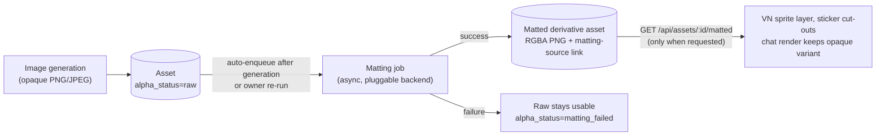

<!-- SPDX-License-Identifier: AGPL-3.0-or-later -->
<!-- SPDX-FileCopyrightText: 2026 giwt Contributors -->

# FEAT: Background Removal — Matting Backends + Alpha Serving

**Status:** ⬜ Not Started
**Priority:** high
**Effort:** high
**Summary:** Background removal for generated character/sprite images — pluggable matting backends (ComfyUI BiRefNet graph, rembg HTTP sidecar, phase-2 in-process ONNX; sd.cpp ruled out — no matting endpoint), async matted derivative, and serving the cut-out on request (`GET /api/assets/:id/matted`).
**Context:** Avatar Alpha Channel + VN Layering epic matting-fallback work item. Matting scaffold landed (`src/generation/matting/`: job lifecycle, state machine, derivative linking) but dormant — nothing constructs a provider from config, no routes trigger matting or serve the derivative, VN render ignores it.
**Acceptance Criteria:** Config-driven backend live (rembg headless default / ComfyUI BiRefNet when enabled); matted derivative auto-produced after generation; cut-out served only when requested; VN sprite stage prefers it (no rectangular halo); owner re-matte route; license-safe model defaults pinned (Bria weights are CC-BY-NC); `bun run check` gates green.
**Epic:** Avatar Alpha Channel + VN Layering
**Tags:** avatar, alpha, matting, background-removal, assets, comfyui, sd-cpp, onnx
**Related:** `TASK-vn-alpha-extraction-matting-job-for-opaque-character-images.md` (job scaffold landed; this ticket absorbs its remaining scope — close at bookkeeping), `TASK-alpha-aware-generation-requests-and-format-pick.md` (generation-time transparency), `TASK-assets-has-alpha-column-and-store-computation.md`, `TASK-decision-av4-matted-output-representation.md`, `matrix-emotion-avatar-assets.md`, `epic-comfyui-plugin.md`

## Summary

Complete the avatar/sprite background-removal pipeline behind the existing
matting scaffold: a generated opaque image gets its background removed (alpha
matting) by a **pluggable backend**, the cut-out is stored as a derivative
asset, and clients can request the image **with the background removed** at
serve time. Today the job lifecycle exists but is dormant — no backend is
constructible from config, no route triggers matting or serves the derivative,
and the VN renderer never prefers the cut-out.

## Current State (verified against code 2026-09-19)

**Landed (scaffold, dormant):**

- `src/generation/matting/` — `MattingService` job lifecycle (eligibility →
  `matting_pending` → `matted`/`matting_failed`, re-runnable with a newer
  model), `MattingProvider` interface (`removeBackground(buffer)` → RGBA PNG),
  `createHttpMattingProvider` (generic HTTP octet-stream→PNG), in-memory job
  store, `enqueueAutoMatting` helper.
- `AssetAlphaStatus` enum (`src/db/enums-content.ts`: `unknown | raw | native |
  matting_pending | matted | matting_failed`) + state machine
  (`src/assets/service/alpha-status.ts`); `assets.alpha_status` column.
- Derivative persistence: matted PNG stored via `createAsset`, linked to the
  raw asset with `asset_links` label `matting-source`; deleting the derivative
  reverts the source to `raw`; deleting the source GCs derivatives
  (`src/assets/service/delete.ts`).
- Emotion-avatar generation auto-enqueues matting **when a provider is passed**
  (`src/characters/services/emotion-avatar-service/generation.ts` — opaque
  RGBA PNGs are force-enqueued as `raw` via the documented override).

**Missing (this ticket):**

1. No provider is ever constructed: `mattingProvider` is threaded as an
   option but nothing builds one from config — `enqueueAutoMatting` returns
   early when `provider` is unset, so matting never runs in production paths.
2. No `matting` config section exists anywhere in `src/config/`.
3. No HTTP surface: no route triggers matting, exposes job status, or serves
   the matted derivative. Serving today is `raw | download | thumb |
   compressed` (`src/assets/controller.ts`) with a matching signed-URL
   allowlist (`src/assets/signed-url.ts`).
4. VN render ignores the derivative: `resolveSpriteUrl` → `getPortraitUrl`
   builds the plain asset URL (`src/frontend/vn/sprite-stage.ts`).
5. Job store is in-memory (restart drops pending jobs) — durable jobs are the
   AV9 `asset_jobs` decision, out of scope here.
6. Encrypted assets (`encryption_tier != public`) are explicitly rejected by
   the matting reader (`service.ts` `#readSourceFile`) — stays a documented
   limitation.

## Approach — generate → matte → serve on request

1. **Generation** — unchanged: opaque generated sprites are stored as
   `alpha_status=raw` (providers emitting RGBA-but-fully-opaque PNGs are
   forced raw by the existing override).
2. **Matting (async, never inline in the generation request)** — with a
   backend configured, `enqueueAutoMatting` fires after generation; owners can
   re-run explicitly (re-matte with a newer model — existing state machine).
   Success = derivative asset + link + `alpha_status=matted`; failure leaves
   the raw usable (existing semantics).
3. **Serving with the background removed, on request** —
   `GET /api/assets/:id/matted` resolves the linked derivative when
   `alpha_status=matted` (404 otherwise), gated by the same access checks as
   `/raw`; `matted` joins the signed-URL action allowlist. Asset projections
   expose `matted_asset_id` so each surface opts in: VN sprite stage prefers
   the cut-out (no rectangular halo); chat bubbles/thumbs keep the opaque
   variant.

## Deep Research — backend selection

All claims verified against primary sources 2026-09-19.

### Option comparison

| Backend | Quality | Deps | Determinism | License | Verdict |
| --- | --- | --- | --- | --- | --- |
| ComfyUI graph, native BiRefNet subgraph | High (hair/fur edges; RGBA + mask) | ComfyUI (already integrated) + MIT weights | High (fixed model; GPU inference) | MIT weights | **Primary when comfy enabled** |
| rembg HTTP sidecar (`rembg s`) | Model-dependent: `birefnet-*`/`isnet-general-use` high, `u2net*` dated | Python sidecar (docker one-liner) | Deterministic (CPU ONNX) | Tool MIT; model-dependent | **Primary headless default** |
| In-process ONNX (transformers.js v3) | Same models as rembg (BiRefNet ONNX) | New npm dep + model download; CPU/WASM speed to validate | Deterministic | MIT (BiRefNet ONNX ports) | Phase 2 — optional |
| sd.cpp (`/sdcpp/v1/*`) | n/a | n/a | n/a | n/a | **Not viable — no matting endpoint** |
| Bria RMBG-1.4/2.0 (self-host weights or ComfyUI `BriaRemoveImageBackground` node / cloud API) | Highest | External API + key (node variant), or weights | Cloud node documented non-deterministic | **CC-BY-NC-4.0** (commercial needs agreement) | Excluded from defaults; opt-in later |
| `@imgly/background-removal(-node)` | Good (isnet default) | npm dep bundling models | Deterministic | **AGPL-3.0** | Excluded — license conflict with LGPL repo |
| Provider-native transparency at generation | Native | None (capability flag work) | n/a (generation, not matting) | Per provider | Preferred rung 0 — sibling ticket |

### 1. ComfyUI graph (native BiRefNet) — primary when ComfyUI is enabled

- BiRefNet is **natively supported in ComfyUI core** (PR #12747); the
  `Remove Background (BiRefNet)` subgraph node ships in recent versions, with
  an official workflow template (`utility_birefnet_remove_background.json`)
  and first-party weights `birefnet.safetensors` at
  `models/background_removal/` (Comfy-Org/BiRefNet, MIT). Outputs an RGBA
  image and mask. Sources:
  [ComfyUI BiRefNet tutorial](https://docs.comfy.org/tutorials/utility/remove-background-birefnet),
  [workflow template](https://github.com/Comfy-Org/workflow_templates/blob/main/templates/utility_birefnet_remove_background.json).
- Repo integration path exists: `ComfyUIClient` (`src/generation/providers/comfyui.ts`)
  can `submitWorkflow`/`waitForCompletion`/`downloadImage`, and the image-edit
  template registry already drives config-file workflows
  (`src/image-edit/template-registry.ts`).
- **Gap to close:** `ComfyUIClient` cannot upload an input image (no
  `/upload/image` call anywhere) — a matting template needs `LoadImage`
  pointing at an uploaded file. Add `uploadImage(buffer)` (POST
  `/upload/image`, multipart) and a builtin `matting` workflow template whose
  `input_image` param binds the uploaded filename. Capability detection:
  extend `/object_info` discovery — the `Remove Background (BiRefNet)`
  subgraph/class (and a `background_removal` model dir) must be present;
  `CAPABILITY_NODE_MAP` in `comfyui-provider.ts` gains a `matting` category.
- The ComfyUI built-in `BriaRemoveImageBackground` node exists but calls the
  **external Bria RMBG 2.0 service** (API key, and the node docs note results
  are non-deterministic) — not used; weights license is non-commercial
  ([node
doc](https://docs.comfy.org/built-in-nodes/BriaRemoveImageBackground)).

### 2. Deterministic HTTP sidecar (rembg) — headless default

- rembg (MIT) ships an HTTP server: `rembg s --host 127.0.0.1 --port 7000`,
  endpoint `POST /api/remove` (multipart `file=@img` or `?url=`, `&dc=true`
  for color decontamination). Models include `birefnet-*` (MIT weights,
  recommended for portraits), `isnet-general-use`, `u2net*`; edge refinement
  modes: naive / decontaminate / alpha-matting / ViTMatte.
  [Source](https://github.com/danielgatis/rembg).
- **License trap:** rembg's **default model is now `bria-rmbg`**, whose
  weights are CC-BY-NC-4.0 (commercial use requires a Bria agreement —
  [RMBG-2.0
  LICENSE](https://github.com/Bria-AI/RMBG-2.0/blob/dev/LICENSE)). Our config
  default must **pin** `isnet-general-use` or `birefnet-general`; document
  that `bria-rmbg`/`RMBG-*` are non-commercial.
- **Wire mismatch:** `createHttpMattingProvider` posts raw
  `application/octet-stream`; rembg expects multipart (or `?url=`). Add a
  `rembg` dialect provider (multipart `file` field, `dc`/`model` params)
  beside the generic one, or a thin sidecar proxy. The generic
  octet-stream provider stays for custom endpoints.

### 3. In-process ONNX (deterministic, phase 2)

- transformers.js v3 officially supports **Bun** (Node/Deno/Bun listed in the
  [v3
  announcement](https://github.com/huggingface/blog/blob/main/transformersjs-v3.md))
  and has a `background-removal` pipeline; BiRefNet ONNX ports exist
  (`onnx-community/BiRefNet-ONNX`, `BiRefNet_512x512-ONNX` fp16 — MIT
  upstream weights, tagged Transformers.js).
- Caveats: new heavyweight dep in an otherwise dependency-light runtime;
  first-run model download (~hundreds of MB for BiRefNet); CPU/WASM latency
  unmeasured for 1024px sprites; `onnxruntime-node` itself targets Node ≥16/20
  with no official Bun support (npm docs) — the WASM backend via transformers.js
  is the safe path. Validate perf before committing; keep behind a config
  flag.
- `@imgly/background-removal-node` does this today but is **AGPL-3.0**
  ([license](https://github.com/imgly/background-removal-js/blob/main/LICENSE.md))
  — incompatible as a vendored dep for this LGPL repo; excluded.

### 4. sd.cpp — not viable today (verified)

- The repo's sdcpp backend speaks leejet stable-diffusion.cpp's server API.
  Its full native surface is `GET /sdcpp/v1/capabilities`, `POST
  /sdcpp/v1/img_gen`, `GET /sdcpp/v1/jobs/{id}`, `POST /sdcpp/v1/jobs/{id}/cancel`,
  `POST /sdcpp/v1/vid_gen`, plus OpenAI (`/v1/images/*`) and WebUI
  (`/sdapi/v1/*`) compatibility families — **generation only, no
  segmentation/matting endpoint**.
  [Source](https://github.com/leejet/stable-diffusion.cpp/blob/master/examples/server/api.md).
- Re-check `GET /sdcpp/v1/capabilities` if/when upstream grows a segmentation
  op; img2img-style "prompt the background away" is not deterministic matting
  and regenerates pixels — rejected.

### 5. Provider-native transparency — rung 0 (sibling ticket)

- `gpt-image-1` accepts `background: "transparent"|"opaque"|"auto"` with
  PNG/WebP output ([OpenAI API
  reference](https://developers.openai.com/api/reference/resources/images/methods/generate))
  — reachable through the existing openai-compatible image provider.
- Seedream via Ark: the 5.0 series supports PNG output with transparent
  backgrounds; 4.x/4.5 are JPEG-only ([third-party Ark-gateway
docs](https://docs.apiyi.com/en/api-capabilities/seedream-image/overview) —
  confirm against Ark docs at implementation).
- Scope lives in `TASK-alpha-aware-generation-requests-and-format-pick.md`
  (capability flag + request passthrough + format pick); this ticket only
  consumes its `alpha_status=native` results.

### Determinism summary

Fixed model + version + params → identical mask: CPU ONNX (rembg sidecar,
in-process) fully deterministic; ComfyUI on GPU deterministic per
model/weights up to vendor kernel scheduling; Bria cloud explicitly
non-deterministic. All backends must record provider name + model id on the
job (provider name already stored; add model id to config and log it) so a
re-run with a newer model is a deliberate act — the state machine already
supports `matted → matting_pending`.

### Recommendation — hybrid ladder

1. **Rung 0 (generation):** request native transparency when the provider
   supports it (sibling ticket) → `alpha_status=native`, no matting needed.
2. **Rung 1a (matting, GPU hosts):** ComfyUI BiRefNet template via the
   existing client/template registry — reuses `epic-comfyui-plugin` infra;
   requires the `uploadImage` gap fix.
3. **Rung 1b (matting, headless default):** rembg HTTP sidecar (docker
   `danielgatis/rembg` or `pip install "rembg[cpu]"` + `rembg s`), model
   pinned to `isnet-general-use`/`birefnet-general`.
4. **Rung 2 (future):** in-process ONNX via transformers.js behind a flag,
   after a CPU-latency spike on real sprite sizes.
5. **Always:** failure is soft — raw stays usable; re-matte is a first-class
   re-run, never a re-roll of the generation.

Selection is config-driven (`matting.backend: none | http | rembg | comfy`,
with comfy auto-detected via `comfyui_enabled` + node discovery when set to
`auto`), mirroring the existing provider registry pattern
(`src/generation/providers/registry.ts`).

## Implementation Slices

1. **Config + factory** — `matting` config section (backend, endpoint, model,
  apiKey, timeoutMs, autoEnqueue) + provider factory; wire the resolved
  provider into emotion-avatar generation opts. No migration (all columns
  exist).
2. **rembg provider** — multipart dialect + decontamination flag; docs
  snippet for running the sidecar; unit tests with stubbed fetch.
3. **Serve on request** — `GET /api/assets/:id/matted` (+ signed-URL action),
  `matted_asset_id` in asset projections; VN `resolveSpriteUrl` prefers the
  derivative when present; e2e for 404/matted/native paths.
4. **Trigger + status routes** — `POST /api/assets/:id/matte` (owner-only
  re-run; 409 while pending), `GET /api/assets/:id/matte` job status from the
  in-memory store (documented restart caveat; durable store follows AV9).
5. **Comfy matting provider** — `ComfyUIClient.uploadImage()`, builtin
  `matting` workflow template (LoadImage → Remove Background (BiRefNet) →
  SaveImage), `/object_info` capability gate, `auto` backend selection.
6. **(Phase 2, flag-gated)** in-process ONNX backend.

## Open Questions

- AV4: keep matted output as a linked root asset (current) vs `asset_renditions`
  kind `matted` — the serving route must resolve whichever representation
  wins; do not block slices 1–4 on the decision.
- Default rembg model pin (`isnet-general-use` general-purpose vs
  `birefnet-general` quality-first) — decide at slice 2 with a visual spot-check
  on generated sprite styles.
- Should `POST .../matte` allow re-matte while `matting_pending` (409 vs
  coalesce)? Proposed: 409 (one in-flight job per asset).

## Acceptance Criteria

- [ ] With `matting.backend=rembg` configured, generating an emotion-avatar
      auto-produces a matted derivative; `GET /api/assets/:id/matted` returns
      the RGBA PNG, `/raw` still returns the opaque original
- [ ] With `matting.backend=comfy` and a BiRefNet-capable ComfyUI, the same
      flow runs through the workflow template; missing node/model degrades to
      a logged skip (raw usable), not an error surface in the chat flow
- [ ] `POST /api/assets/:id/matte` re-runs matting on `matted`/`matting_failed`
      assets (newer model) and 409s while pending; 404/403 for
      missing/non-owned assets
- [ ] VN sprite stage renders the cut-out when available (no rectangular
      halo); chat bubble/thumb paths unchanged
- [ ] Signed URLs work for the `matted` action
- [ ] Config default pins a permissively-licensed model; `bria-rmbg`/
      `RMBG-*` documented as non-commercial
- [ ] Failure paths verified: backend down (job `failed`, raw usable,
      `matting_failed`), non-image asset (404/400), encrypted asset (rejected
      with existing error)
- [ ] Tests passing (`bun run check` gates green; matting + serving unit/e2e)
- [ ] Documentation updated (config reference + sidecar/comfy setup guides)
