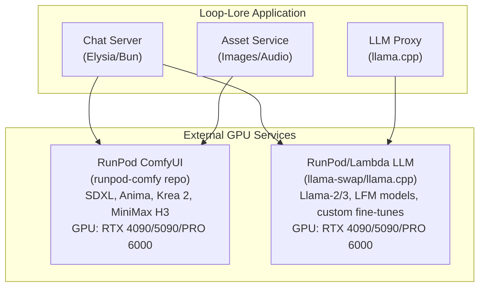

<!-- SPDX-License-Identifier: Apache-2.0 -->
<!-- SPDX-FileCopyrightText: 2026 Loop Lore Contributors -->

# GPU Compute Separation for Loop-Lore

**Status:** Not Started
**Priority:** medium
**Effort:** Medium
**Summary:** (none captured)
**Context:** (none captured)
**Acceptance Criteria:** (none captured)

## Architecture Overview

## Service Separation

### RunPod ComfyUI (Image/Video Generation)

- **Repository**: `/home/flak/git-ai/runpod-comfy`
- **Purpose**: SDXL, Anima, Krea 2, Minimax H3
- **GPU Requirements**: RTX 4090 (24GB) minimum, PRO 6000 (48GB) for 4K+ video
- **Deployment**: RunPod Serverless with network volumes
- **Models Stored**: SDXL checkpoints, LoRAs, ControlNet, Anima models, Minimax H3

### LLM Inference Service (Text Generation)

- **Purpose**: llama-swap, llama.cpp for chat completion
- **GPU Requirements**: RTX 4090 (24GB) or A100 (40GB) for larger contexts
- **Deployment Options**:
  - RunPod Serverless (separate endpoint)
  - Lambda Labs (steady-state)
  - Vast.ai (cost-sensitive)
- **Models**: Llama-3-8B/70B, LFM, custom fine-tunes

## Updated Hosting Recommendations

| Service | Primary Provider | Instance Type | Est. Cost/hr |
|---------|------------------|---------------|--------------|
| **ComfyUI** | RunPod | RTX 4090 (24GB) | $0.50/sec |
| **LLM Inference** | RunPod | RTX 4090 (24GB) | $0.50/sec |
| **LLM Inference (alt)** | Lambda Labs | A100 40GB | $1.29/hr |
| **LLM Inference (budget)** | Vast.ai | RTX 3090 (24GB) | $0.50-1.00/hr |

## Implementation Notes

1. **RunPod ComfyUI** - Already configured in `/home/flak/git-ai/runpod-comfy`
   - Deploy as-is for image/video generation
   - No LLM code needed in this repo

2. **LLM Inference** - New RunPod endpoint needed
   - Create separate `runpod-llama` repo or extend existing
   - Use `llama.cpp` server with OpenAI-compatible API
   - Configure for serverless with model caching

3. **Network Architecture**
   - Loop-lore server → ComfyUI endpoint (images/video)
   - Loop-lore server → LLM endpoint (text)
   - Both can use RunPod network volumes for model storage

4. **Cost Optimization**
   - ComfyUI: Scale to zero when idle (RunPod Flex workers)
   - LLM: Active workers for low-latency chat (RunPod Active workers)
   - Shared network volume for model storage (~$0.07/GB/month)

## Next Steps

1. **Deploy runpod-comfy** as-is for SDXL/Anima/Krea 2/Minimax H3
2. **Create runpod-llama** repository for LLM inference
3. **Update loop-lore config** to point to both endpoints
4. **Test end-to-end** chat → LLM → ComfyUI workflows