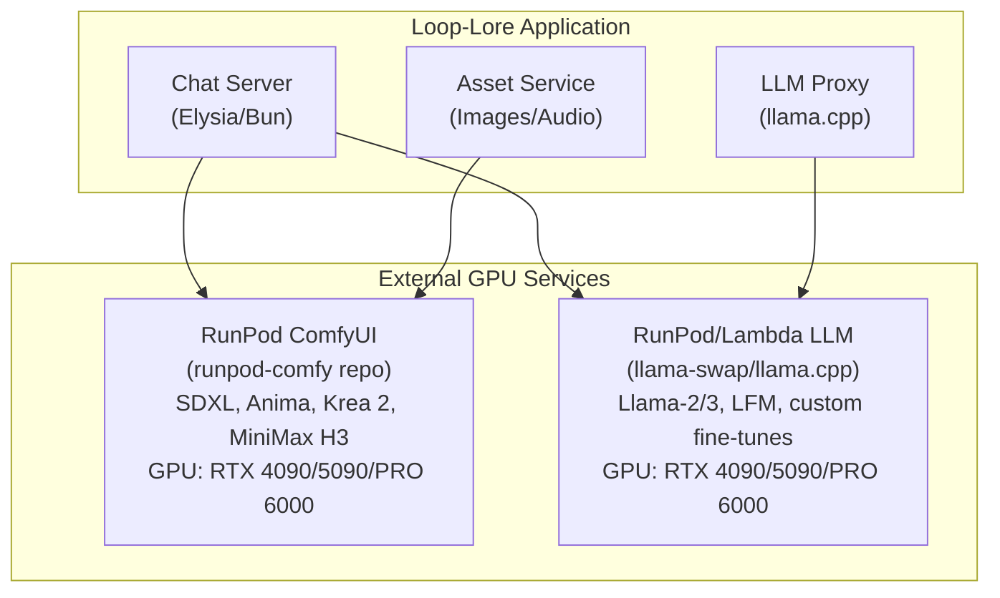

<!-- SPDX-License-Identifier: Apache-2.0 -->
<!-- SPDX-FileCopyrightText: 2026 Loop Lore Contributors -->

# TASK-003: GPU Compute Separation for Loop-Lore

**Status:** open
**Priority:** medium
**Effort:** Medium
**Summary:** Separate GPU compute layers — ComfyUI vs LLM inference on dedicated instances.
**Context:** Service separation diagram and RunPod/Lambda hosting matrix.
**Acceptance Criteria:** See ## Acceptance Criteria below.

**Status:** open
**Priority:** medium
**Epic:** epic-deployment-infrastructure
**Labels:** infrastructure, gpu, deployment
**Assignee:** Platform Team

## Summary

Document the split between loop-lore's in-process services and external GPU compute endpoints, producing `docs/infrastructure/gpu-separation.md` that fixes the architecture boundary (Chat Server / Asset Service / LLM Proxy talk to dedicated RunPod ComfyUI and RunPod/Lambda LLM endpoints), per-service model storage rules, and the cost-optimized scaling policy for each tier.

## Context

- **Scope covered**: Service boundaries between loop-lore's Elysia/Bun app and external GPU services (ComfyUI image/video, llama-swap LLM), including model storage, network connectivity, and scaling policy.
- **Inputs**: `runpod-comfy` companion repo (already configured for SDXL/Anima/Krea 2/MiniMax H3), `runpod-llama` to-be-built companion repo, and `epic-llm-queue.md` / `epic-resource-provision.md`.
- **Outputs**: Architecture doc at `docs/infrastructure/gpu-separation.md` with mermaid diagram, service-tier table, and implementation playbook.

## Architecture Overview

## Service Separation

### RunPod ComfyUI (image / video generation)

- **Companion repo**: `/home/flak/git-ai/runpod-comfy`
- **Purpose**: SDXL, Anima, Krea 2, MiniMax H3
- **GPU Requirements**: RTX 4090 (24 GB) minimum, PRO 6000 (48 GB) for 4K+ video
- **Deployment**: RunPod Serverless with network volumes
- **Models Stored**: SDXL checkpoints, LoRAs, ControlNet, Anima models, MiniMax H3

### LLM Inference Service (text generation)

- **Purpose**: llama-swap, llama.cpp for chat completion
- **GPU Requirements**: RTX 4090 (24 GB) or A100 (40 GB) for larger contexts
- **Deployment Options**:
  - RunPod Serverless (separate endpoint)
  - Lambda Labs (steady-state)
  - Vast.ai (cost-sensitive)
- **Models**: Llama-3-8B/70B, LFM, custom fine-tunes

## Updated Hosting Recommendations

| Service              | Primary Provider | Instance Type      | Est. Cost/hr     |
|----------------------|------------------|--------------------|------------------|
| ComfyUI              | RunPod           | RTX 4090 (24 GB)   | ~$0.50/hr        |
| LLM Inference        | RunPod           | RTX 4090 (24 GB)   | ~$0.50/hr        |
| LLM Inference (alt)  | Lambda Labs      | A100 40 GB         | $1.29/hr         |
| LLM Inference (budget) | Vast.ai        | RTX 3090 (24 GB)   | $0.50–1.00/hr    |

## Implementation Notes

1. **RunPod ComfyUI** — already configured in `/home/flak/git-ai/runpod-comfy`
   - Deploy as-is for image/video generation.
   - No LLM code needed in this repo.
2. **LLM Inference** — new RunPod endpoint needed
   - Create separate `runpod-llama` repo or extend existing.
   - Use `llama.cpp` server with OpenAI-compatible API.
   - Configure for serverless with model caching.
3. **Network Architecture**
   - Loop-lore server → ComfyUI endpoint (images/video).
   - Loop-lore server → LLM endpoint (text).
   - Both can use RunPod network volumes for model storage.
4. **Cost Optimization**
   - ComfyUI: scale to zero when idle (RunPod Flex workers).
   - LLM: active workers for low-latency chat (RunPod Active workers).
   - Shared network volume for model storage (~$0.07/GB/month).

## Acceptance Criteria

- Document published at `docs/infrastructure/gpu-separation.md`.
- Document includes the mermaid service-boundary diagram (Chat Server / Asset Service / LLM Proxy → ComfyUI + LLM endpoints).
- Per-service table lists primary provider, instance type, and estimated cost/hour for each tier.
- Implementation playbook enumerates deployment steps for both `runpod-comfy` (existing) and `runpod-llama` (to be built).
- Cost-optimization section documents scale-to-zero vs. always-on worker policy per tier.
- Cross-linked from `epic-deployment-infrastructure.md` and `TASK-003-gpu-requirements.md`.

## Related Files

- `docs/infrastructure/gpu-separation.md` (to be created) — primary deliverable.
- `runpod-comfy/` (existing, sibling repo) — ComfyUI deployment.
- `runpod-llama/` (to be created, sibling repo) — llama.cpp serverless endpoint.
- `docs/infrastructure/gpu-requirements.md` (to be created, see TASK-003-gpu-requirements) — sizing matrix reused here.

## Next Steps

1. Deploy `runpod-comfy` as-is for SDXL / Anima / Krea 2 / MiniMax H3.
2. Create `runpod-llama` repository for LLM inference.
3. Update loop-lore config to point to both endpoints.
4. Test end-to-end chat → LLM → ComfyUI workflows.

## Notes

- Sibling cross-links: `TASK-003-gpu-requirements.md`, `TASK-003-hosting-comparison.md`, `TASK-003-evaluate-hostings.md`.
- Open question: do we host `runpod-llama` in-tree as `infra/runpod-llama/`, or keep it as a sibling repo for blast-radius isolation?