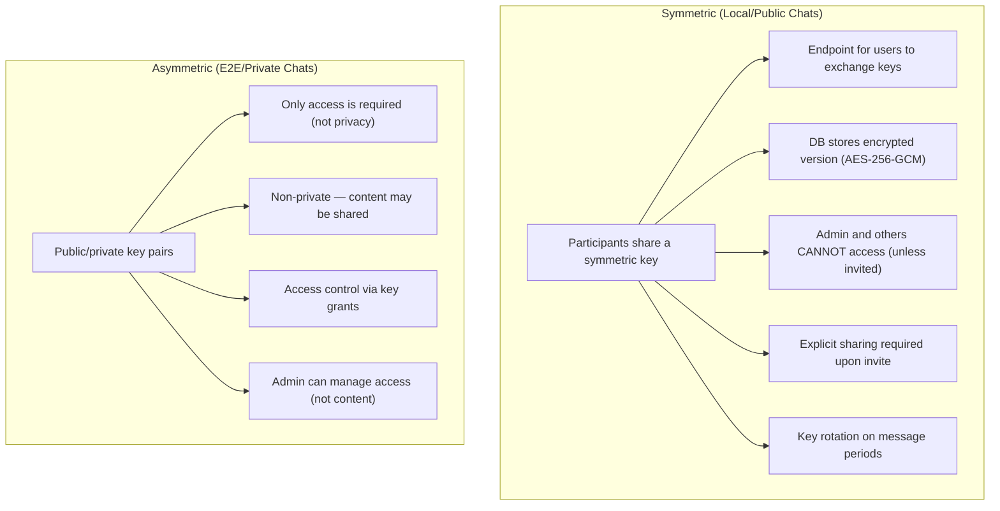

<!-- SPDX-License-Identifier: Apache-2.0 -->
<!-- SPDX-FileCopyrightText: 2026 Loop Lore Contributors -->

# TASK: Encryption Architecture Clarification — Symmetric vs Asymmetric

**Summary:** (none captured)
**Context:** (none captured)
**Acceptance Criteria:** (none captured)

**Status:** open
**Priority:** High
**Effort:** —
**Epic:** epic-crypto
**Parent:** TASK-epic17-encryption-e2e-expansion
**Source:** User clarification, 2026-07-20

## Summary

Two encryption models: **Symmetric** (local/public chats) and **Asymmetric** (e2e/private chats). Different key management, access control, and sharing semantics.

## Encryption Models

### Symmetric (Local/Public Chats)

**Characteristics:**

- Public/private key pairs per user
- Access control: who can decrypt (not who can see)
- Admin manages access (not content)
- Sharing: grant access, not share key
- Use case: private DMs, sensitive content, access-controlled

## Key Differences

| Aspect       | Symmetric              | Asymmetric                   |
| ------------ | ---------------------- | ---------------------------- |
| Key type     | Shared secret          | Public/private pair          |
| Key exchange | Endpoint between users | Key grants                   |
| Admin access | None (zero-knowledge)  | Manages access (not content) |
| Sharing      | Explicit key share     | Grant access                 |
| Rotation     | On message periods     | On access revocation         |
| Use case     | Group/team chats       | Private DMs                  |

## Implementation Impact

### Symmetric (Local)

- [ ] Key exchange endpoint: `POST /api/chats/:id/exchange-key`
- [ ] Key storage: encrypted with participant's actor key
- [ ] Rotation: automatic on `MESSAGE_PERIOD` config
- [ ] Invite flow: share key with new participant
- [ ] Admin: cannot access (zero-knowledge)

### Asymmetric (E2E)

- [ ] Key pair generation: per user (public/private)
- [ ] Public key distribution: `GET /api/users/:id/public-key`
- [ ] Access grants: `POST /api/chats/:id/grant-access`
- [ ] Access revocation: `POST /api/chats/:id/revoke-access`
- [ ] Admin: manages access (not content)

## Tasks

- [ ] Design key exchange endpoint (symmetric)
- [ ] Design key pair generation (asymmetric)
- [ ] Design access grant/revocation flow
- [ ] Design rotation on message periods
- [ ] Update schema for both models
- [ ] Update UI for both models

## Files to Modify

- `src/crypto/key-exchange.ts` — symmetric key exchange
- `src/crypto/key-pairs.ts` — asymmetric key pairs
- `src/routes/keys.ts` — key management endpoints
- `src/frontend/alpine/key-management.ts` — UI for both models

## Risk

Med — two encryption models, different key management, different sharing semantics.

## Linked Epics

- `epic-crypto.md`
