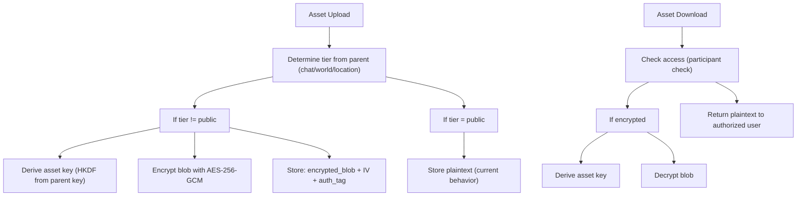

<!-- SPDX-License-Identifier: Apache-2.0 -->
<!-- SPDX-FileCopyrightText: 2026 Loop Lore Contributors -->

# TASK: Encryption — Asset Encryption

**Summary:** (none captured)
**Context:** (none captured)
**Acceptance Criteria:** (none captured)

**Status:** 🟨 Partial
**Priority:** Medium
**Effort:** Med
**Parent:** TASK-epic17-encryption-e2e-expansion
**Blocked by:** TASK-encryption-wire-message-pipeline

## Summary

Encrypt asset blobs (images, audio, video) when stored in standard/private tier chats. Assets inherit the parent entity's encryption tier.

## What Exists

- `src/assets/service.ts` — asset CRUD
- `src/assets/controller.ts` — asset routes
- `src/crypto/pipeline.ts` — compress-then-encrypt (reuse for assets)

## Design

## Tasks

- [x] Add `encryption_tier` column to `assets` table
- [x] Add `encrypted_key_id` column to `assets` table
- [x] On upload: if tier ≠ public, encrypt blob before storage
- [x] On download: if encrypted, decrypt blob before serving
- [ ] Key derivation: parent key → asset key (HKDF)
- [ ] Add tests: encrypt on upload, decrypt on download, tier inheritance

## Files Created

- `src/crypto/asset-encryption.ts` — encrypt/decrypt asset blobs ✅
- `src/db/migrations/016_asset_encryption.ts` — migration ✅

## Files Modified

- `src/db/schema-content.ts` — added encryption_tier and encrypted_key_id ✅
- `src/assets/service.ts` — encrypt on upload, decrypt on download ✅
- `src/assets/controller.ts` — wire encryption in routes ✅
- `src/crypto/index.ts` — export asset encryption functions ✅

## Risk

Low–Med — pipeline exists, just needs wiring to assets. Large file encryption performance.

## Known Issue

Upload-encrypt + download-decrypt are wired, but there is no parent→asset HKDF
subkey (all assets in a chat share the parent chat key). Asset reads re-derive
the current key, so asset history breaks on membership change — see
`BUG-chat-key-history-loss-join-leave.md`.
