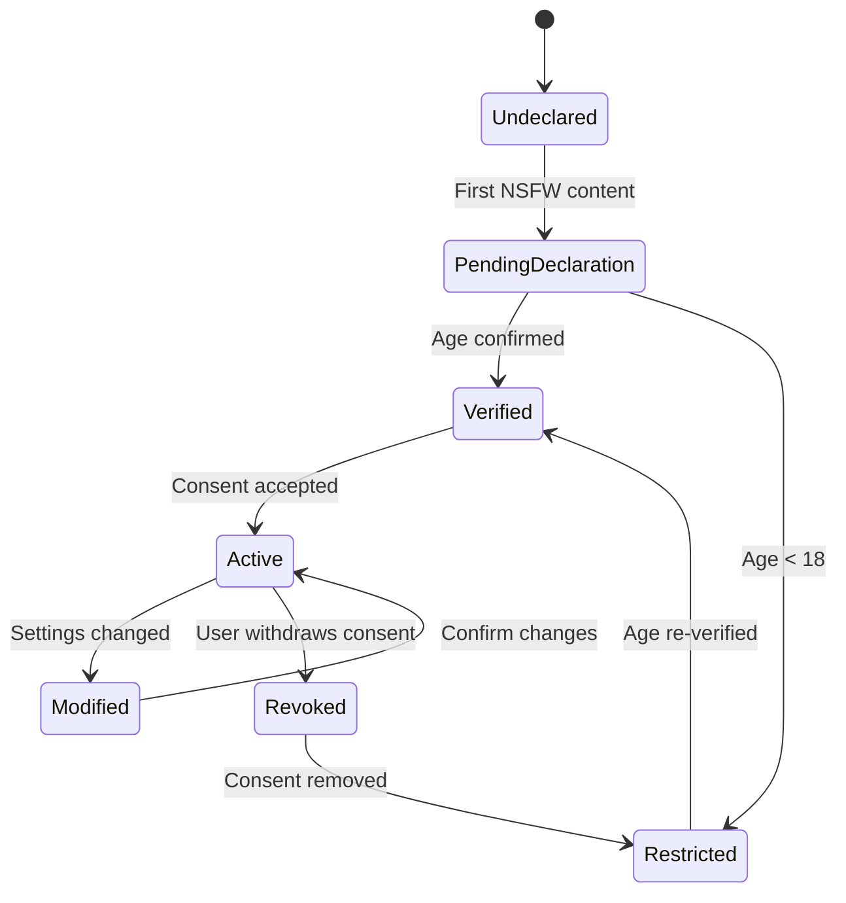

# NSFW/AO Experience Research

## Overview

Research on adult/NSFW experience improvements for deployments that allow mature content.
Focus on consent, safety, age verification, and responsible design.

---

## 1. Age Verification Enhancements

### Multi-Layer Verification

```typescript
interface AgeVerification {
  // Self-declaration (current)
  self_declaration: {
    age: number;
    timestamp: Date;
    signature?: string; // Hash of declaration
  };

  // Enhanced verification (optional)
  enhanced?: {
    method: "id_scan" | "credit_card" | "third_party";
    verified: boolean;
    expires: Date;
    provider?: string;
  };

  // Session tracking
  sessions: {
    count: number;
    last_used: Date;
    context_level: "solo" | "shared" | "public";
  };
}
```

### Verification Escalation

| Risk Level | Requirement           | Implementation    |
| ---------- | --------------------- | ----------------- |
| Low        | Self-declaration      | Current age gate  |
| Medium     | 30-day reaffirmation  | Periodic prompts  |
| High       | Enhanced verification | External provider |
| Shared     | Explicit consent log  | Per-chat consent  |

---

## 2. Consent Mechanics

### Granular Consent Model

```typescript
interface ConsentSettings {
  // Content types
  sexual_content: "explicit" | "implied" | "none";
  violence: "graphic" | "moderate" | "minimal" | "none";
  thematic_elements: string[]; // Custom tags

  // Interaction boundaries
  npc_relationships: {
    romance: boolean;
    intimacy: boolean;
    power_dynamics: boolean;
  };

  // Narrative control
  narrative_limits: {
    fade_to_black: boolean; // Stop at cliffhanger
    explicit_scene_filter: boolean; // Auto-filter explicit content
    memory_redaction: boolean; // Redact explicit memories
  };
}
```

### Consent State Machine



---

## 3. Safety Tooling

### Real-Time Safety Filters

```typescript
interface SafetyFilters {
  // Content screening
  content_filter: {
    level: "strict" | "moderate" | "permissive";
    custom_keywords: string[];
    regex_patterns: string[];
  };

  // Boundary enforcement
  boundaries: {
    hard_limit: string[]; // Never generate
    soft_limit: string[]; // Flag for review
    sensitivity_threshold: number; // 0-100
  };

  // Panic button
  emergency_stop: {
    enabled: boolean;
    auto_archive: boolean;
    cooldown_period: number; // Minutes
  };
}
```

### Content Redaction

```typescript
// Redact explicit content in memories
function redactExplicit(content: string, level: "full" | "partial" | "none"): string {
  if (level === "full") return "[Content redacted]";

  const patterns = [/\b(sexual act|penetrat|orgasm|ejaculat)\b/gi, /\b(naked|bare|unclothed)\b/gi];

  if (level === "partial") {
    return patterns.reduce((acc, p) => acc.replace(p, "[redacted]"), content);
  }
  return content;
}
```

---

## 4. Session Management for NSFW

### Isolated Sessions

```typescript
interface NSFWSession {
  id: string;
  user_id: string;

  // Isolation flags
  isolated_storage: boolean; // No cross-contamination
  encrypted_at_rest: boolean; // AES-256-GCM
  auto_delete: Date | null; // TTL for sensitive sessions

  // Context boundaries
  allowed_characters: string[]; // Whitelist
  forbidden_tags: string[]; // Blacklist

  // Audit trail
  access_log: {
    timestamp: Date;
    action: "read" | "write" | "export" | "delete";
  }[];
}
```

### Memory Hygiene

```typescript
// Auto-purge explicit memories
interface MemoryPolicy {
  explicit_auto_purge: {
    enabled: boolean;
    after_days: number;
    confirm_before_purge: boolean;
  };

  // Selective retention
  retention_rules: {
    romantic_memories: { keep: boolean; duration_days?: number };
    sexual_memories: { keep: boolean; duration_days?: number };
    violence_memories: { keep: boolean; duration_days?: number };
  };
}
```

---

## 5. Privacy Considerations

### Data Segregation

```typescript
// Separate storage for NSFW content
const NSFW_STORAGE = {
  db_path: "data/nsfw.db",
  asset_path: "data/assets/nsfw/",
  encryption_key: "user_secret_key", // Not SMK
};

// Access logging
interface NSFWAccessLog {
  user_id: string;
  session_id: string;
  timestamp: Date;
  action: "create" | "read" | "update" | "delete" | "export";
  content_type: "chat" | "character" | "asset" | "memory";
  size_bytes?: number;
}
```

### Export Controls

```typescript
interface ExportRestrictions {
  nsfw_export: {
    allowed: boolean;
    requires_consent: boolean;
    watermark: boolean;
    retention_days: number; // Auto-delete exports
  };

  // Format limitations
  format_restrictions: {
    markdown: boolean;
    json: boolean;
    pdf: "watermarked" | "disabled";
  };
}
```

---

## 6. Character Safety

### NSFW Character Flags

```typescript
interface CharacterNSFWFlags {
  // Content warnings
  content_warnings: string[]; // ["sexual_content", "violence", "mind_break"]

  // Relationship boundaries
  relationship_boundaries: {
    romance_allowed: boolean;
    intimacy_allowed: boolean;
    power_dynamic_restrictions: string[];
  };

  // Session control
  nsfw_only: boolean; // Only in NSFW-verified sessions
  consent_required: boolean; // Per-session confirmation
}
```

### Boundary Enforcement

```typescript
// Check before NSFW interaction
async function checkNSFWConsent(user: User, character: Character): Promise<boolean> {
  if (!user.nsfw_verified) return false;
  if (character.nsfw_only && !session.is_nsfw) return false;
  if (character.consent_required) {
    return await promptForConsent(user, character);
  }
  return true;
}
```

---

## 7. Deployment Configuration

### NSFW Mode Toggle

```yaml
# config.yaml
nsfw:
  enabled: false # Master switch
  require_age_verification: true
  require_consent: true
  enhanced_verification: false
  audit_logging: true

  # Content controls
  default_filter_level: "moderate"
  explicit_memory_auto_purge: true
  explicit_memory_purge_days: 30

  # Storage
  isolated_storage: true
  encrypt_at_rest: true
```

### Environment Variables

```bash
# Required for NSFW deployments
NSFW_ENABLED=true
NSFW_ENHANCED_VERIFICATION=false
NSFW_AUDIT_LOG=true
NSFW_ISOLATED_STORAGE=true
```

---

## 8. User Experience Patterns

### Consent Flow

```typescript
// First-time NSFW access
async function nsfwOnboarding(user: User) {
  // 1. Age verification
  await verifyAge(user);

  // 2. Consent settings
  const settings = await presentConsentForm();
  await saveConsent(user, settings);

  // 3. Safety briefing
  await showSafetyTools();

  // 4. Boundary setup
  await configureBoundaries();
}
```

### Safety Dashboard

```typescript
interface SafetyDashboard {
  // Current status
  nsfw_verified: boolean;
  consent_active: boolean;
  active_filters: string[];

  // Quick actions
  emergency_stop: () => void;
  export_logs: () => void;
  modify_consent: () => void;
  purge_explicit: () => void;

  // Statistics
  content_generated: number;
  filters_triggered: number;
  sessions_active: number;
}
```

---

## 9. Moderation Tooling

### Admin Oversight

```typescript
interface NSFWModeration {
  // Review queue
  review_queue: {
    pending: number;
    flagged: number;
    auto_rejected: number;
  };

  // Analytics
  analytics: {
    daily_active_users: number;
    content_volume: number;
    filter_effectiveness: number;
  };

  // Intervention tools
  tools: {
    session_review: (sessionId: string) => Promise<void>;
    content_redact: (contentId: string) => Promise<void>;
    user_restriction: (userId: string, duration: string) => Promise<void>;
  };
}
```

---

## 10. Surveillance Protection

### Zero-Knowledge Architecture

Users must be safe from surveillance — including platform operators and admins.
Moderation needs do not override user privacy.

```typescript
// Client-side encryption for sensitive content
interface SurveillanceProtection {
  // Content never leaves client unencrypted
  client_side_encryption: {
    enabled: boolean;
    algorithm: "AES-256-GCM";
    key_derivation: "PBKDF2" | "scrypt" | "argon2";
  };

  // Admin blind spots
  admin_blind_spots: {
    message_content: boolean; // Admins cannot read message bodies
    memory_content: boolean; // Admins cannot read memories
    asset_content: boolean; // Admins cannot access asset binaries
    session_content: boolean; // Admins cannot view session details
  };

  // Moderation metadata only
  moderation_metadata: {
    // What admins CAN see
    session_count: number;
    user_activity_pattern: boolean; // Anonymized aggregates only
    filter_triggers: number;
    violation_reports: boolean;
    // What admins CANNOT see
    message_text: false;
    character_names: false;
    asset_descriptions: false;
  };
}
```

### Moderation Without Content Access

```typescript
// Report-based moderation
interface AnonymousReport {
  report_id: string;
  reporter_id: string; // Only used for abuse prevention
  target_session: string; // Reference only, no content
  violation_type: string;
  timestamp: Date;
  // NO message content, NO user identity in report

  // Resolution path
  resolution: {
    action: "review" | "warn" | "restrict" | "dismiss";
    reason: string; // Generic, not referencing content
    moderator_id: string;
  };
}

// Violation detection without reading content
class SurveillanceSafeModeration {
  // Detect from metadata only
  async detectViolation(sessionId: string): Promise<boolean> {
    const metrics = await this.getSessionMetrics(sessionId);

    // Red flags from behavior, not content
    return (
      metrics.message_rate > 100 && metrics.time_window < 60 || // spam
      metrics.same_character_repeats > 50 || // botting
      metrics.suspicious_patterns > threshold // pattern matching on metadata
    );
  }

  // Report resolution without content access
  async resolveReport(report: AnonymousReport): Promise<void> {
    // Only act on metadata patterns
    // Never expose message content to moderator
    if (report.violation_type === "spam") {
      await this.applyRateLimit(report.target_session);
    }
  }
}
```

### Privacy-Preserving Analytics

```typescript
// Aggregate-only metrics
interface PrivacySafeMetrics {
  // Safe to collect (aggregated, anonymized)
  daily_active_nsfw_users: number; // Count only, no identity
  session_duration_avg: number; // Average, no user linking
  filter_trigger_rate: number; // Percentage, no content
  consent_acceptance_rate: number; // Overall stats

  // NEVER collected
  individual_user_activity: false;
  message_content_analytics: false;
  character_interaction_graphs: false;
  detailed_session_logs: false;
}
```

---

## 11. Implementation Checklist

- [ ] Age verification service extension
- [ ] Consent settings UI
- [ ] Safety filter integration
- [ ] Memory redaction system
- [ ] Isolated storage configuration
- [ ] Client-side encryption for sensitive sessions
- [ ] Admin blind spot enforcement
- [ ] Report-based moderation system
- [ ] Privacy-safe analytics collection
- [ ] Export watermarking
- [ ] Audit logging (metadata only)
- [ ] Emergency stop functionality
- [ ] Admin moderation dashboard (metadata view only)
- [ ] Session isolation enforcement
