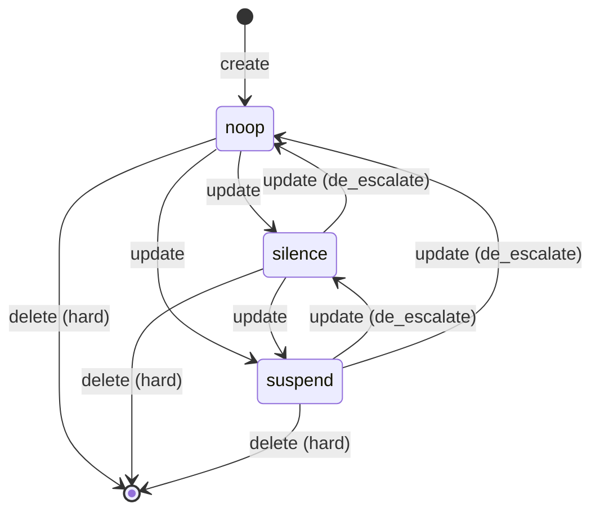

<!-- SPDX-License-Identifier: Apache-2.0 -->
<!-- SPDX-FileCopyrightText: 2026 Loop Lore Contributors -->
<!-- Companion to: .plan/tickets/TASK-federation-defederation-admin-operations-peer-state-block-al.md -->
<!-- Research basis: .tmp/fed-research/topic-2-defederation.md -->

# SPEC: Federation Defederation Admin Operations — Implementation

**Companion to:** `TASK-federation-defederation-admin-operations-peer-state-block-al.md`
**Status:** ready for implementation
**Author:** research synthesis, 2026-09-24
**Research basis:** `/.tmp/fed-research/topic-2-defederation.md`

---

## Design Decisions (resolved from open questions)

| Question (from research) | Decision | Rationale |
| --- | --- | --- |
| `reject_media` / `reject_reports` as standalone noop-level flags? | YES, all three boolean flags are composable at every severity tier | Matches Mastodon's API contract; lets ops express "silence + reject media" without bumping severity |
| Per-user instance blocking (Lemmy-style)? | YES, separate table `user_instance_blocks` | Lemmy users want per-person opt-out from a domain; cheap to add on top of admin-side defederation |
| Outbound Tombstone/Delete on suspend? | Local purge only; NO outbound Tombstone fan-out | Outbound Tombstones require per-actor identity management that loop-lore does not have yet; flagged as a follow-up |
| Pre-defederation content retention? | Keep (Lemmy-style); no auto-purge on suspend | Lemmy's `instance_actions` model keeps pre-defederation content visible; loop-lore follows that to avoid content loss |
| Mastodon-compatible CSV blocklist import/export? | YES, schema aligned with `domain,severity,reject_media,reject_reports,public_comment,private_comment,obfuscate` | Adoption lever for cross-instance blocklist sharing; minimal extra code |
| Idempotency on second defederate? | Return existing transition row; HTTP 200 with `already_suspended: true` | Matches industry convention (Stripe-style idempotent admin actions) |
| Webhook fan-out on defederate? | Optional; controlled by `config.federation.defederation_webhook` | Operators may want to notify other trusted instances; opt-in keeps the surface minimal |
| Hard delete on defederate? | Yes via `?hard=true` — removes the row entirely from `defederation_blocks` AND purges any cached peer state | Some ops want a clean slate; default is suspend (soft) |

---

## 1. Database Schema

### `defederation_blocks` — current state

```sql
CREATE TABLE defederation_blocks (
  id              TEXT PRIMARY KEY,            -- ULID
  domain          TEXT NOT NULL UNIQUE,        -- canonicalized via canonicalOrigin()
  severity        TEXT NOT NULL DEFAULT 'silence'
                    CHECK (severity IN ('noop','silence','suspend')),
  reject_media    BOOLEAN NOT NULL DEFAULT false,
  reject_reports  BOOLEAN NOT NULL DEFAULT false,
  obfuscate       BOOLEAN NOT NULL DEFAULT false,
  public_comment  TEXT,                        -- shown in /api/admin/defederation responses
  private_comment TEXT,                        -- admin-only audit context
  digest          TEXT,                        -- sha256(domain); per Mastodon tamper-detect
  created_at      TIMESTAMPTZ NOT NULL DEFAULT now(),
  updated_at      TIMESTAMPTZ NOT NULL DEFAULT now()
);

CREATE INDEX defederation_blocks_severity_idx ON defederation_blocks(severity);
```

### `defederation_audit_log` — append-only

```sql
CREATE TABLE defederation_audit_log (
  id           TEXT PRIMARY KEY,                 -- ULID
  block_id     TEXT REFERENCES defederation_blocks(id) ON DELETE SET NULL,
  actor_id     TEXT NOT NULL,                    -- admin user id
  action       TEXT NOT NULL                     -- 'create'|'update'|'delete'|'escalate'|'de_escalate'
                  CHECK (action IN ('create','update','delete','escalate','de_escalate')),
  domain       TEXT NOT NULL,
  prev_state   JSONB,                            -- snapshot before (NULL on create)
  next_state   JSONB,                            -- snapshot after
  reason       TEXT,                             -- free-text <=512 chars (server-validated)
  request_id   TEXT,                             -- ties to request_results.id for cross-trace
  created_at   TIMESTAMPTZ NOT NULL DEFAULT now()
);

CREATE INDEX defederation_audit_log_domain_created_idx
  ON defederation_audit_log(domain, created_at DESC);
CREATE INDEX defederation_audit_log_actor_created_idx
  ON defederation_audit_log(actor_id, created_at DESC);
```

### `user_instance_blocks` — per-user opt-out

```sql
CREATE TABLE user_instance_blocks (
  user_id     TEXT NOT NULL,
  domain      TEXT NOT NULL,
  reason      TEXT,
  blocked_at  TIMESTAMPTZ NOT NULL DEFAULT now(),
  PRIMARY KEY (user_id, domain)
);
```

### Kysely types — colocate in `src/db/schema-defederation.ts`

```ts
export type Severity = "noop" | "silence" | "suspend";
export type DefederationAction = "create" | "update" | "delete" | "escalate" | "de_escalate";

export interface DefederationBlocksTable {
  id: string;
  domain: string;
  severity: Severity;
  reject_media: boolean;
  reject_reports: boolean;
  obfuscate: boolean;
  public_comment: string | null;
  private_comment: string | null;
  digest: string | null;
  created_at: Date;
  updated_at: Date;
}
export interface DefederationAuditLogTable {
  id: string;
  block_id: string | null;
  actor_id: string;
  action: DefederationAction;
  domain: string;
  prev_state: unknown | null;
  next_state: unknown;
  reason: string | null;
  request_id: string | null;
  created_at: Date;
}
export interface UserInstanceBlocksTable {
  user_id: string;
  domain: string;
  reason: string | null;
  blocked_at: Date;
}
```

Migration: `src/db/migrations/0XX_defederation_blocks.ts` (append-only; sequential next).

---

## 2. State Machine



`escalate` action in audit log is shorthand for `update` with severity going up; `de_escalate` for severity going down. Boolean flags (`reject_media`, `reject_reports`, `obfuscate`) flip independently.

---

## 3. API Endpoints (admin-authz guarded)

### `GET /api/admin/defederation`

List blocks, paginated via Link header (consistent with rest of admin API).

```ts
query: { severity?: Severity; reject_media?: 'true'; reject_reports?: 'true'; limit?: number; cursor?: string }
response: { data: DefederationBlock[]; next_cursor: string | null }
```

### `GET /api/admin/defederation/:id`

Single block detail including the full audit history inline.

### `POST /api/admin/defederation`

Create a block.

```ts
body: {
  domain: string;            // canonicalized server-side
  severity?: Severity;       // default 'silence'
  reject_media?: boolean;
  reject_reports?: boolean;
  obfuscate?: boolean;
  public_comment?: string;
  private_comment?: string;
  reason: string;            // REQUIRED <=512 chars
}
response: 201 { block: DefederationBlock; transition: DefederationAuditLogEntry }
errors: 409 if domain already blocked (return existing block)
```

### `PUT /api/admin/defederation/:id`

Update an existing block. Body shape mirrors POST without `domain`. Action in audit log is `update` if booleans/severity change but stay at same level, `escalate` if severity increases, `de_escalate` if it decreases.

### `DELETE /api/admin/defederation/:id`

Lift the block. `?hard=true` removes the row entirely (irreversible — audit log entry remains). Default is a soft delete via `severity='noop'`.

### `GET /api/admin/defederation/audit`

Paginated audit log.

```ts
query: { domain?: string; actor_id?: string; action?: DefederationAction; since?: ISO; until?: ISO; limit?: number; cursor?: string }
response: { data: DefederationAuditLogEntry[]; next_cursor: string | null }
```

### `POST /api/admin/defederation/users/:user_id/blocks` (per-user)

Block a domain for a single user (Lemmy parity).

```ts
body: { domain: string; reason?: string }
```

### `GET /api/admin/defederation/export`

CSV export in Mastodon format:

```csv
domain,digest,severity,reject_media,reject_reports,public_comment,private_comment,obfuscate
example.com,sha256:abcd...,suspend,false,true,"CSAM distribution",,false
spam.xyz,sha256:1234...,noop,true,false,"Bulk DM spam",,false
```

### `POST /api/admin/defederation/import`

Mastodon-format CSV import. Default behavior: **dry-run**, returns preview; `?commit=true` applies.

```ts
response: 200 {
  preview: Array<{ domain: string; will_create: boolean; will_update: boolean; current_severity: Severity | null }>;
  applied: boolean;
}
```

---

## 4. Module Layout

```
src/federation/defederation/
├── index.ts            # public API: getBlock, listBlocks, federate, defederate
├── schema.ts           # re-export the Kysely tables + types
├── service.ts          # business logic — state machine + audit log + side effects
├── routes.ts           # Elysia handlers — admin authz guard wraps all
├── csv.ts              # export/import (Mastodon-format parser + serializer)
├── digest.ts           # sha256(domain) helper (per Mastodon Admin::DomainBlock)
└── defederation.test.ts
```

The service is callable from the future audit-probe ticket (`TASK-federation-peer-audit-probe-zero-trust-cross-instance-verifi`) for auto-suspend on repeated probe failures.

---

## 5. Service Contract

```ts
// src/federation/defederation/service.ts
import type { Kysely, Transaction } from "kysely";
import type { DB } from "../../db/schema";
import type { DefederationBlock, Severity, DefederationAuditLogEntry } from "./schema";

export interface AdminCaller { actor_id: string; role: "admin"; request_id: string; }

export interface CreateBlockInput {
  domain: string;
  severity?: Severity;        // default 'silence'
  reject_media?: boolean;
  reject_reports?: boolean;
  obfuscate?: boolean;
  public_comment?: string;
  private_comment?: string;
  reason: string;             // required, <=512 chars
}

export interface CreateBlockResult {
  block: DefederationBlock;
  transition: DefederationAuditLogEntry;
  already_existed: false;
}

export interface UpdateBlockInput {
  severity?: Severity;
  reject_media?: boolean;
  reject_reports?: boolean;
  obfuscate?: boolean;
  public_comment?: string;
  private_comment?: string;
  reason: string;
}

export interface DefederateResult {
  block: DefederationBlock;
  transition: DefederationAuditLogEntry;
  already_suspended: boolean;   // true if a no-op call against existing suspended peer
}

/** Create or return existing block for the same domain. */
export function createBlock(db: Kysely<DB>, caller: AdminCaller, input: CreateBlockInput): Promise<CreateBlockResult>;

/** Update severity / boolean flags; emits escalate/de_escalate based on transition. */
export function updateBlock(db: Kysely<DB>, caller: AdminCaller, block_id: string, input: UpdateBlockInput): Promise<{ block: DefederationBlock; transition: DefederationAuditLogEntry }>;

/**
 * Defederate: bumps severity to 'suspend' (or removes the row entirely when hard=true).
 * Idempotent: a second call against an already-suspended peer returns already_suspended=true.
 *
 * Side effects (only when severity actually transitions to suspend):
 *   - peer_registry.last_seen = 0 (force eviction from in-memory PeerTable on next gossip tick)
 *   - all outbound delivery_queue rows for that domain -> status='dead_letter'
 *   - structured log: federation.defederate { actor, domain, hard, reason }
 *   - optional webhook fan-out (config.federation.defederation_webhook)
 */
export function defederate(db: Kysely<DB>, caller: AdminCaller, block_id: string, opts: { hard?: boolean; reason: string }): Promise<DefederateResult>;

/** Re-promote a suspended/silenced peer back to a less severe tier (de_escalate). */
export function refederate(db: Kysely<DB>, caller: AdminCaller, block_id: string, input: UpdateBlockInput): Promise<{ block: DefederationBlock; transition: DefederationAuditLogEntry }>;

export function listBlocks(db: Kysely<DB>, opts: { severity?: Severity; limit?: number; cursor?: string }): Promise<{ data: DefederationBlock[]; next_cursor: string | null }>;
export function listAudit(db: Kysely<DB>, opts: { domain?: string; actor_id?: string; action?: string; since?: Date; until?: Date; limit?: number; cursor?: string }): Promise<{ data: DefederationAuditLogEntry[]; next_cursor: string | null }>;
export function exportCsv(db: Kysely<DB>): Promise<string>;
export interface ImportPreviewEntry { domain: string; will_create: boolean; will_update: boolean; current_severity: Severity | null; next_severity: Severity; }
export function previewImport(db: Kysely<DB>, csv_body: string, caller: AdminCaller): Promise<{ preview: ImportPreviewEntry[]; applied: false }>;
export function commitImport(db: Kysely<DB>, csv_body: string, caller: AdminCaller): Promise<{ preview: ImportPreviewEntry[]; applied: true }>;

/** Per-user blocking (Lemmy parity). */
export function blockUserInstance(db: Kysely<DB>, user_id: string, domain: string, reason?: string): Promise<void>;
export function unblockUserInstance(db: Kysely<DB>, user_id: string, domain: string): Promise<void>;
export function listUserInstanceBlocks(db: Kysely<DB>, user_id: string): Promise<Array<{ domain: string; blocked_at: Date }>>;
```

All mutations run inside a Kysely transaction so the audit row and the block row commit atomically.

---

## 6. Side Effects on Defederate (`defederate()`)

These run **only** when severity actually transitions to `suspend` (or when `hard=true` removes the row).

1. **Peer eviction** — `UPDATE peer_registry SET last_seen = 0, state = 'suspended' WHERE origin = $domain`.
2. **Delivery queue dead-letter** — `UPDATE delivery_queue SET status = 'dead_letter', dead_lettered_at = now() WHERE peer_origin = $domain AND status IN ('queued','in_flight')`. Bulk update; do NOT fan-out Tombstones.
3. **Structured log** — `log.event({ event: 'federation.defederate', actor_id, domain, hard, reason, severity_before, severity_after })`.
4. **In-memory peer-table hook** — call `peerTable.evict(domain)` to force an immediate in-process eviction (without waiting for TTL). The peer-table module already has an `evict` hook in `src/federation/gossip.ts`; verify and use.
5. **Webhook (optional)** — if `config.federation.defederation_webhook` is set, POST `{ domain, severity, reason, actor_id, timestamp }` to that URL. Non-blocking; log on failure but do not fail the defederation.

---

## 7. Validation

### Elysia `t` schemas (TypeBox)

```ts
// src/validation/schemas/defederation.ts
import { t } from "elysia";

export const SeveritySchema = t.Union([t.Literal("noop"), t.Literal("silence"), t.Literal("suspend")]);

export const CreateBlockBodySchema = t.Object({
  domain: t.String({ minLength: 1, maxLength: 253, pattern: "^[a-z0-9.-]+$" }),
  severity: t.Optional(SeveritySchema),
  reject_media: t.Optional(t.Boolean()),
  reject_reports: t.Optional(t.Boolean()),
  obfuscate: t.Optional(t.Boolean()),
  public_comment: t.Optional(t.String({ maxLength: 1024 })),
  private_comment: t.Optional(t.String({ maxLength: 1024 })),
  reason: t.String({ minLength: 1, maxLength: 512 }),
});

export const UpdateBlockBodySchema = t.Object({
  severity: t.Optional(SeveritySchema),
  reject_media: t.Optional(t.Boolean()),
  reject_reports: t.Optional(t.Boolean()),
  obfuscate: t.Optional(t.Boolean()),
  public_comment: t.Optional(t.String({ maxLength: 1024 })),
  private_comment: t.Optional(t.String({ maxLength: 1024 })),
  reason: t.String({ minLength: 1, maxLength: 512 }),
});

export const DefederationBlockResponseSchema = t.Object({
  id: t.String(),
  domain: t.String(),
  severity: SeveritySchema,
  reject_media: t.Boolean(),
  reject_reports: t.Boolean(),
  obfuscate: t.Boolean(),
  public_comment: t.Union([t.String(), t.Null()]),
  private_comment: t.Union([t.String(), t.Null()]),
  digest: t.Union([t.String(), t.Null()]),
  created_at: t.String(),
  updated_at: t.String(),
});
```

---

## 8. Logging

Use the structured logger (`src/logger/`). Events:

```ts
log.event({ event: "federation.defederate.create", actor_id, domain, severity, reject_media, reject_reports, obfuscate });
log.event({ event: "federation.defederate.update", actor_id, block_id, domain, prev_state, next_state, escalate });
log.event({ event: "federation.defederate.delete", actor_id, block_id, domain, hard });
log.event({ event: "federation.defederate.user", user_id, domain, action: "block"|"unblock" });
log.event({ event: "federation.defederate.import", actor_id, rows_created, rows_updated, dry_run });
```

`reason` is included in the log on defederate/delete so the audit log line is sufficient for incident review without a separate `defederation_audit_log` SELECT.

---

## 9. Test Plan

### Unit (`src/federation/defederation/defederation.test.ts`)

- `createBlock` happy path + 409 on duplicate domain (returns existing).
- `updateBlock` severity escalation emits `action='escalate'`; de-escalation emits `action='de_escalate'`.
- `defederate` first call moves trusted -> suspended; second call returns `already_suspended: true` with HTTP 200.
- `defederate({ hard: true })` removes the row but keeps the audit log entry.
- Audit log `prev_state` / `next_state` JSON snapshots are correct.
- CSV export round-trips: export -> parse with the import preview -> identical preview.
- CSV import dry-run does not write; commit writes in a transaction.
- `defederate` side effects:
  - peer_registry.last_seen = 0 (assert via SELECT)
  - delivery_queue rows moved to dead_letter
  - structured log emitted with the correct fields
  - peerTable.evict was called (mock the gossip module)
- Per-user block: `blockUserInstance` then `listUserInstanceBlocks` returns the row; `unblockUserInstance` removes it.

### Integration (`src/federation/defederation/defederation.integration.test.ts`)

- Spin up a fake peer (mocked HTTP server that returns `/nodeinfo/2.1`), put it in `peer_registry` as trusted, defederate it, assert subsequent gossip fetch returns 403/connection-refused because the in-memory PeerTable evicted it.

### E2E (`tests/e2e/admin-defederation.test.ts`)

- As admin: POST `/api/admin/defederation` with severity=suspend. Then GET `/api/admin/defederation/audit` shows the transition with `actor_id` = the test admin. Then DELETE `?hard=true` removes the row; the audit entry persists with `action='delete'`.
- Non-admin caller receives 403.

---

## 10. Acceptance Criteria (refined)

- [ ] Schema migration `0XX_defederation_blocks.ts` lands with the three tables + indexes.
- [ ] `createBlock` / `updateBlock` / `defederate` / `refederate` / `listBlocks` / `listAudit` service functions implemented and unit-tested.
- [ ] `POST/GET/PUT/DELETE /api/admin/defederation` + audit endpoints all behind admin authz guard.
- [ ] CSV export + import (dry-run + commit) implemented with Mastodon-compatible column order.
- [ ] Per-user block endpoints (`POST/DELETE /api/admin/defederation/users/:user_id/blocks` + `GET` listing).
- [ ] Side effects: peer eviction, delivery queue dead-letter, structured log, optional webhook fan-out.
- [ ] Defederate is idempotent (second call returns `already_suspended: true`, HTTP 200).
- [ ] Reason is REQUIRED on create / update / defederate (<=512 chars).
- [ ] All audit log rows include `actor_id`, `request_id`, `prev_state`, `next_state`, `created_at`.
- [ ] Integration test covers the defederate side effects against a real peer_registry + delivery_queue.
- [ ] `bun run check` green.

---

## 11. Out-of-Scope Follow-Ups (filed separately)

- Frontend UI (`IDEA-federation-admin-ui-for-follows-blocklists-key-rotation`).
- Outbound Tombstone / Delete activities on suspend (requires actor-key infra).
- Bulk defederation by reason/pattern (single-origin only here).
- Probe-driven auto-defederate — owned by `TASK-federation-peer-audit-probe-zero-trust-cross-instance-verifi` (which calls into this service).

---

## 12. References

1. Mastodon admin/domain_blocks API: https://docs.joinmastodon.org/methods/admin/domain_blocks/
2. Mastodon Admin::DomainBlock entity: https://brookmiles.github.io/mastodon-documentation/entities/Admin_DomainBlock/
3. Mastodon moderation docs: https://docs.joinmastodon.org/admin/moderation/
4. Lemmy federation system: https://deepwiki.com/LemmyNet/lemmy/3-federation-system
5. WiseChecker — Suspend vs Silence: https://wisechecker.com/mastodon-suspend-vs-silence-domain-blocks/
6. Research synthesis: `/.tmp/fed-research/topic-2-defederation.md`
