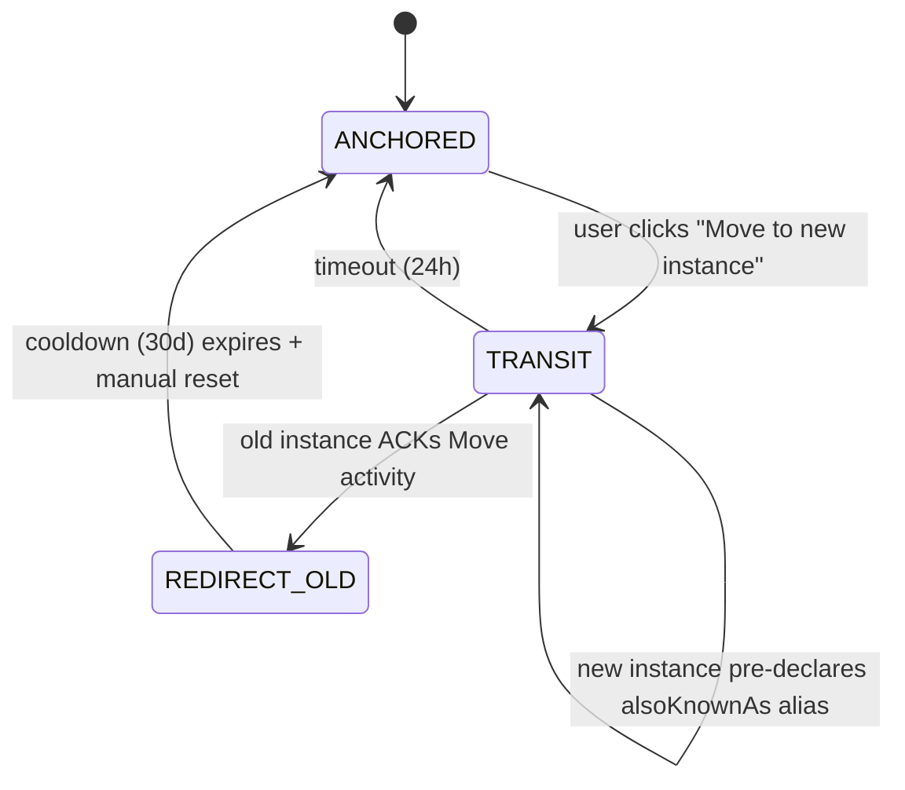

<!-- SPDX-License-Identifier: Apache-2.0 -->
<!-- SPDX-FileCopyrightText: 2026 Loop Lore Contributors -->
<!-- Companion to: .plan/tickets/TASK-federation-instance-switcher-in-frontend-travel-between-inst.md -->
<!-- Research basis: .tmp/fed-research/topic-3-instance-switcher.md -->

# SPEC: Federated Instance Switcher (Frontend) — Implementation

**Companion to:** `TASK-federation-instance-switcher-in-frontend-travel-between-inst.md`
**Status:** ready for implementation
**Author:** research synthesis, 2026-09-24
**Research basis:** `/.tmp/fed-research/topic-3-instance-switcher.md`

---

## Design Decisions (resolved from open questions)

| Question (from research) | Decision | Rationale |
| --- | --- | --- |
| Primary content type for loop-lore? | Community/subscription-shaped (Lemmy model) — worlds, characters, chat rooms are subscription primitives, not post streams | Loop-lore's worlds + characters map to Lemmy's communities; Move-style post migration does not fit |
| Posts migrate or only followers? | Redirect + re-subscribe (Lemmy / Diaspora-style) — no full content copy | Diaspora pod-hopping shows the way; full copy is too costly |
| Who drives the switch — user or server? | USER-initiated (Mastodon-style) with optional admin-driven alias pre-declaration | Matches the existing auth model (per-instance session issuance via `epic-auth-access.md`) |
| Active-origin or proxy-origin (multi-origin)? | ACTIVE-ORIGIN — one canonical origin at a time per session | Simplifies Alpine store + htmx partials; multi-origin is a separate ticket (Diaspora-style aspects) |
| Cooldown/revocation? | 30-day migration cooldown (Mastodon parity) — old instance shows read-only redirect banner | Industry convention; matches `epic-auth-access.md` session rotation semantics |
| Discovery source for the picker? | Multi-source: NodeInfo on each known peer + Lemmy `linked_instances` + (optional) `instances.social` aggregator | Lemmy's crawler pattern is the most authoritative; aggregator APIs are a fallback |

---

## 1. Active-Origin Session Model

```
Session {
  primary_origin: string         // the instance that issued this session — never changes
  active_origin: string          // current "instance context" the user is operating in
  accounts: Account[]            // credentials for multiple instances, primary first
}

Account {
  instance: string               // canonical origin
  username: string               // local handle on that instance
  token: string                  // per-instance bearer token (or signed cookie)
  also_known_as?: string[]       // aliases (Mastodon-style migration preparation)
  added_at: Date
}

State:
  ANCHORED      — active_origin = accounts[0].instance (home)
  TRANSIT       — user clicked "switch"; awaiting new session issuance
  REDIRECT_OLD  — old account marked read-only after a Move activity fires
```

Storage:
- `localStorage['federation.session']` — full Session JSON (encrypted via the existing session crypto).
- Cookie `federation.active_origin` — single value, mirrored, used by htmx partials to scope server-rendered HTML.
- Server-side: `federation_active_origin` column on `users` table (server is the authority; the cookie/localStorage are read-through caches).

---

## 2. Alpine Store

```ts
// src/frontend/alpine/stores/federation.ts
import { defineStore } from "alpinejs";

export interface FederationAccount {
  instance: string;
  username: string;
  added_at: string;
}

export interface FederationState {
  primary_origin: string;
  active_origin: string;
  accounts: FederationAccount[];
  switching: boolean;
  error: string | null;
}

export const federationStoreFactory = (initial: FederationState) => ({
  ...initial,
  get isHome(): boolean { return this.active_origin === this.primary_origin; },
  get activeLabel(): string {
    if (this.isHome) return "Home";
    const acct = this.accounts.find((a) => a.instance === this.active_origin);
    return acct ? `${acct.username}@${this.active_origin}` : this.active_origin;
  },
  async switchTo(origin: string): Promise<void> {
    if (origin === this.active_origin) return;
    if (!this.accounts.some((a) => a.instance === origin)) {
      throw new Error(`unknown origin: ${origin}`);
    }
    this.switching = true;
    this.error = null;
    try {
      const res = await fetch("/api/federation/switch", {
        method: "POST",
        headers: { "Content-Type": "application/json" },
        body: JSON.stringify({ origin }),
      });
      if (!res.ok) {
        const body = await res.json().catch(() => ({}));
        throw new Error(body.error || `switch failed: ${res.status}`);
      }
      this.active_origin = origin;
      document.cookie = `federation.active_origin=${encodeURIComponent(origin)}; path=/; SameSite=Lax; Max-Age=31536000`;
      // Re-fetch the page partial — htmx renders the active-origin-scoped version.
      // (htmx trigger on body: hx-trigger="federation:switched" hx-get="/partials/main")
      window.dispatchEvent(new CustomEvent("federation:switched", { detail: { origin } }));
    } catch (e) {
      this.error = (e as Error).message;
    } finally {
      this.switching = false;
    }
  },
  async returnHome(): Promise<void> {
    return this.switchTo(this.primary_origin);
  },
  async addInstance(origin: string): Promise<void> {
    // 1. Probe origin reachability
    const probe = await fetch("/api/federation/probe", {
      method: "POST",
      headers: { "Content-Type": "application/json" },
      body: JSON.stringify({ origin }),
    });
    if (!probe.ok) throw new Error(`origin unreachable: ${probe.status}`);
    // 2. Server returns its NodeInfo + asks for OAuth / per-instance session token.
    const { nodeinfo, oauth_url } = await probe.json();
    // 3. Redirect to oauth_url; on return, the server persists the Account.
    window.location.href = oauth_url;
  },
});
```

The store is registered in the existing `src/frontend/alpine/index.ts` registry alongside `sessionStore` etc.

---

## 3. Top-bar UI

```html
<!-- src/views/partials/federation/instance-picker.html -->
<div
  x-data="federationStore"
  class="federation-instance-picker"
  @federation:switched.window="$store.federation.reload()"
>
  <button
    type="button"
    class="instance-trigger"
    @click="open = !open"
    :aria-expanded="open"
    hx-get="/partials/federation/instance-dropdown"
    hx-trigger="click once"
    hx-swap="outerHTML"
  >
    <span class="instance-origin" x-text="activeLabel"></span>
    <span class="badge" x-show="!isHome" x-text="`via ${active_origin}`"></span>
  </button>
  <div class="instance-dropdown" x-show="open" @click.outside="open = false">
    <template x-for="acct in accounts" :key="acct.instance">
      <button
        type="button"
        class="instance-option"
        :class="{ active: acct.instance === active_origin }"
        @click="switchTo(acct.instance)"
      >
        <span x-text="acct.username + '@' + acct.instance"></span>
        <span x-show="acct.instance === primary_origin">Home</span>
      </button>
    </template>
    <button type="button" class="instance-add" @click="openAdd = true">+ Add instance…</button>
    <div x-show="openAdd" class="instance-add-modal">
      <input type="text" x-model="newOrigin" placeholder="https://instance.example" />
      <button @click="addInstance(newOrigin)">Connect</button>
      <button @click="openAdd = false">Cancel</button>
    </div>
  </div>
</div>
```

The picker mounts in the existing top-bar layout (look at `src/views/partials/top-bar.html` for the integration point).

Keyboard shortcut: `g i` opens the picker. The existing command palette (`src/frontend/alpine/command-palette.ts`) handles this.

---

## 4. Backend Endpoints

### `GET /api/federation/state`

Returns the current Session's `federationState` for Alpine hydration.

```ts
response: {
  primary_origin: string;
  active_origin: string;
  accounts: FederationAccount[];
  isHome: boolean;
}
```

### `POST /api/federation/switch`

Sets the active origin. Issues a new per-instance session token if needed (via the existing `epic-auth-access.md` seam) and sets the `federation.active_origin` cookie + DB column.

```ts
body: { origin: string }
response: { active_origin: string; switched_at: Date }
errors: 401 if not authenticated; 404 if origin not in user's accounts
```

### `POST /api/federation/probe`

Probes an origin for reachability and returns its NodeInfo.

```ts
body: { origin: string }
response: {
  reachable: boolean;
  nodeinfo?: NodeInfo21;
  oauth_url?: string;            // URL to redirect the user to for account linking
  error?: string;
}
```

### `POST /api/federation/accounts`

Persist a new account after OAuth flow returns. (Backend of the Add-instance modal.)

```ts
body: { origin: string; token: string; username: string }
response: 201 { account: FederationAccount }
```

### `DELETE /api/federation/accounts/:origin`

Remove an account from the user's session. Cannot remove the primary origin.

### `POST /api/federation/migrate`

Initiate a Migration activity (Mastodon-style `Move` + `alsoKnownAs`). Server-side state machine: ANCHORED -> TRANSIT -> REDIRECT_OLD on the old instance.

```ts
body: { old_origin: string; new_origin: string; also_known_as: string }
response: { migration_id: string; status: "in_progress" }
```

### `GET /partials/federation/instance-dropdown`

htmx partial: returns the dropdown HTML for htmx swap.

### `GET /partials/main?active_origin=...`

htmx partial for the main content area, scoped to the active origin.

---

## 5. Database Schema

```sql
CREATE TABLE user_federation_accounts (
  id            TEXT PRIMARY KEY,                  -- ULID
  user_id       TEXT NOT NULL,
  origin        TEXT NOT NULL,                     -- canonical origin
  username      TEXT NOT NULL,                     -- local handle on that instance
  also_known_as TEXT,                              -- JSON array; Mastodon-style aliases
  is_primary    BOOLEAN NOT NULL DEFAULT false,
  session_token TEXT,                              -- encrypted per-instance bearer
  added_at      TIMESTAMPTZ NOT NULL DEFAULT now(),
  updated_at    TIMESTAMPTZ NOT NULL DEFAULT now(),
  UNIQUE (user_id, origin)
);

CREATE INDEX user_federation_accounts_user_idx ON user_federation_accounts(user_id);

-- Migration tracking (separate from defederation audit log; this is user-driven)
CREATE TABLE user_federation_migrations (
  id             TEXT PRIMARY KEY,                 -- ULID
  user_id        TEXT NOT NULL,
  old_origin     TEXT NOT NULL,
  new_origin     TEXT NOT NULL,
  also_known_as  TEXT NOT NULL,                    -- the alias pre-declaration
  status         TEXT NOT NULL                     -- 'in_progress'|'completed'|'failed'|'expired'
                  CHECK (status IN ('in_progress','completed','failed','expired')),
  old_instance_ack BOOLEAN NOT NULL DEFAULT false,
  started_at     TIMESTAMPTZ NOT NULL DEFAULT now(),
  completed_at   TIMESTAMPTZ,
  cooldown_until TIMESTAMPTZ                       -- 30-day cooldown per Mastodon convention
);

CREATE INDEX user_federation_migrations_user_idx ON user_federation_migrations(user_id);
```

Add to `users` table:

```sql
ALTER TABLE users ADD COLUMN active_origin TEXT;   -- server-side mirror of the Alpine store
```

Migration: `src/db/migrations/0XX_user_federation_accounts.ts`.

---

## 6. Module Layout

```
src/federation/switcher/
├── index.ts                # public: getFederationState, switchActive, addAccount, etc.
├── service.ts              # business logic + DB
├── routes.ts               # Elysia handlers (POST/GET/DELETE on /api/federation/*)
├── migration.ts            # Move-activity state machine (Mastodon-style)
└── switcher.test.ts

src/frontend/alpine/stores/
└── federation.ts           # federationStoreFactory (Alpine store)

src/views/partials/federation/
├── instance-picker.html    # top-bar trigger
└── instance-dropdown.html  # htmx partial

src/views/partials/
└── main.html               # update existing to scope by ?active_origin=
```

---

## 7. Active-Origin Scoping for htmx Partials

Every server-rendered htmx partial that lists worlds/chats/characters gains a `?active_origin=<...>` query param. The server's `routes/worlds/index.ts`, `routes/chats/index.ts`, etc. check this param and:

- If `active_origin == user.primary_origin`: render from the local DB.
- If `active_origin != user.primary_origin`: render via the per-instance proxy (the remote instance's worlds/chats endpoint, fetched using the per-instance bearer token) and tag each row with `class="remote-origin"` + a "via `<remote>`" badge.

This stays transparent to existing partials — only the data source changes.

```ts
// src/routes/worlds/index.ts (existing; minimal diff)
app.get("/partials/worlds", async (ctx) => {
  const user = await requireUser(ctx);
  const activeOrigin = ctx.cookie["federation.active_origin"] ?? user.primary_origin;
  const worlds = activeOrigin === user.primary_origin
    ? await db.selectFrom("worlds").selectAll().execute()
    : await remoteWorlds(activeOrigin, user.sessionTokenFor(activeOrigin));
  return <WorldsList worlds={worlds} activeOrigin={activeOrigin} />;
});
```

---

## 8. Migration State Machine (Mastodon-style)



Old instance while REDIRECT_OLD:
- Reads return a `<Moved-To>{ new_handle }</Moved-To>` banner.
- Writes rejected with HTTP 410 Gone.

This state machine lives in `src/federation/switcher/migration.ts` and is wired to the future ActivityPub adapter (`FEAT-activitypub-federation`).

---

## 9. Validation

### Elysia `t` schemas

```ts
// src/validation/schemas/federation-switcher.ts
import { t } from "elysia";

export const SwitchBodySchema = t.Object({
  origin: t.String({ minLength: 1, maxLength: 253 }),
});

export const ProbeBodySchema = t.Object({
  origin: t.String({ minLength: 1, maxLength: 253, pattern: "^https?://[a-z0-9.-]+(/.*)?$" }),
});

export const AddAccountBodySchema = t.Object({
  origin: t.String({ minLength: 1, maxLength: 253 }),
  token: t.String({ minLength: 1, maxLength: 4096 }),
  username: t.String({ minLength: 1, maxLength: 64 }),
});
```

---

## 10. Logging

```ts
log.event({ event: "federation.switcher.state", user_id, active_origin, primary_origin });
log.event({ event: "federation.switcher.switch", user_id, from, to, duration_ms });
log.event({ event: "federation.switcher.probe", origin, reachable, software });
log.event({ event: "federation.switcher.account_add", user_id, origin });
log.event({ event: "federation.switcher.account_remove", user_id, origin });
log.event({ event: "federation.switcher.migrate_start", user_id, old_origin, new_origin });
log.event({ event: "federation.switcher.migrate_complete", user_id, migration_id });
```

---

## 11. Test Plan

### Unit (`src/federation/switcher/switcher.test.ts`)

- `getFederationState` returns the user's primary + accounts.
- `switchActive` updates the active_origin and issues a new per-instance session if needed.
- `addAccount` rejects when the probe fails.
- `removeAccount` rejects when the account is the primary.
- Migration state machine: ANCHORED -> TRANSIT -> REDIRECT_OLD transitions; timeout returns to ANCHORED with error flag.

### Alpine store (`src/frontend/alpine/stores/federation.test.ts`)

- `isHome` getter returns true when active == primary.
- `activeLabel` returns "Home" for home, "user@origin" for remote.
- `switchTo` POSTs to `/api/federation/switch`; on success sets cookie + dispatches `federation:switched` event.
- `addInstance` probes first, then redirects.

### E2E (`tests/e2e/federation-switcher.test.ts`)

- Sign in as test user (primary instance A).
- Open the picker, "Add instance" with a mock B instance URL, complete OAuth.
- Switch to B; assert the top-bar label changes to `user@B`, the worlds list shows the "via B" badge, the cookie `federation.active_origin=B` is set.
- Return home; assert the cookie is cleared and the badge disappears.
- Initiate migration A -> B; assert the migration row is in `user_federation_migrations` with status `in_progress`.

---

## 12. Acceptance Criteria (refined)

- [ ] Top-bar instance picker with Home + known instances + Add modal.
- [ ] Alpine store covers state + transitions; tested in isolation.
- [ ] `switchTo` updates active_origin, sets cookie + DB column, dispatches `federation:switched`.
- [ ] htmx partials scope by `active_origin`; remote rows show "via `<remote>`" badge.
- [ ] Per-instance session tokens stored encrypted in `user_federation_accounts.session_token`.
- [ ] `addInstance` probes reachability before persisting.
- [ ] Migration state machine (ANCHORED/TRANSIT/REDIRECT_OLD) implemented; 30-day cooldown enforced.
- [ ] E2E test covers switch -> render -> return-home cycle and migration flow.
- [ ] `bun run check` green.

---

## 13. Out-of-Scope Follow-Ups

- Multi-origin simultaneous (Diaspora-style aspects) — separate ticket.
- Admin defederation UI (`IDEA-federation-admin-ui-for-follows-blocklists-key-rotation`).
- Cross-instance content migration (full asset / lore copy) — gated by `epic-instance-federation.md` §"Cross-Sync".
- ActivityPub Move activity fan-out — depends on `FEAT-activitypub-federation`.

---

## 14. References

1. Mastodon moving accounts: https://docs.joinmastodon.org/user/moving/
2. Mastodon ActivityPub spec: https://docs.joinmastodon.org/spec/activitypub/
3. Diaspora user/person models: https://deepwiki.com/diaspora/diaspora/2.1-user-and-person-models
4. Diaspora federation architecture: https://deepwiki.com/diaspora/diaspora/1.3-federation-architecture
5. Lemmy account migration issue: https://github.com/LemmyNet/lemmy/issues/3057
6. LASIM settings migrator: https://github.com/CMahaff/lasim
7. WiseChecker — Mastodon Move propagation: https://wisechecker.com/mastodon-migration-activitypub-move-activity-propagation/
8. Pixelfed multi-account: https://github.com/pixelfed/pixelfed-rn/issues/266
9. Research synthesis: `/.tmp/fed-research/topic-3-instance-switcher.md`
