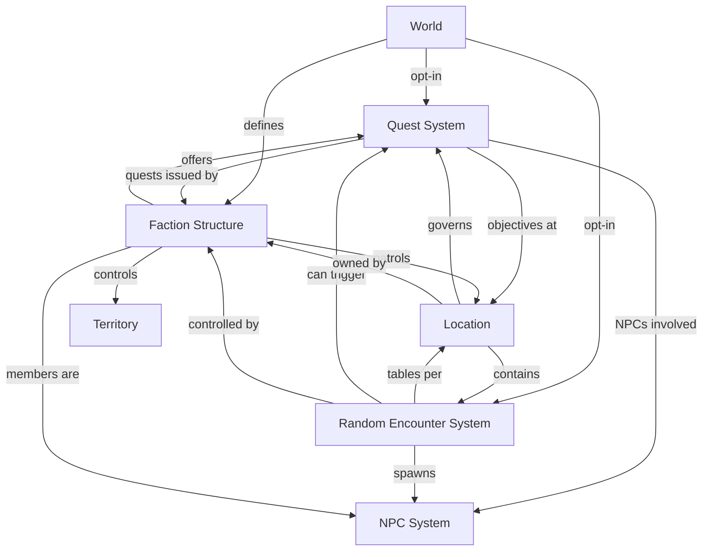

<!-- SPDX-License-Identifier: Apache-2.0 -->
<!-- SPDX-FileCopyrightText: 2026 Loop Lore Contributors -->

# Quests, Random Encounters & Faction Structure

**Status:** Draft
**Supersedes:** Quest-related notes in `docs/spec/rpg-mechanics.md`, encounter notes in `docs/spec/locations.md`
**Extends:** `docs/spec/npcs.md`, `docs/spec/worlds.md`, `docs/spec/locations.md`
**Authoritative source:** `src/` and `AGENTS.md`

---

## Overview

This document defines three interrelated systems:

1. **Quest System** — structured objectives with prerequisites, chains, and rewards
2. **Random Encounter System** — location-based encounter tables with triggers and generation rules
3. **Faction Structure** — factions with heroes, villains, NPCs, territories, and inter-faction relations

These systems are **opt-in per world and per location** — worlds can enable/disable each system independently, and locations can override world defaults.

---

## 1. Quest System

### 1.1 Quest Types

Quests are classified along TWO orthogonal axes (see
`.plan/epics/epic-quests-encounters.md` → Quest Type Taxonomy):

**Axis 1 — Completion Mechanic (`type`, canonical, 7 values)**

| `type`       | Progress measured by                     |
| ------------ | ---------------------------------------- |
| `time`       | in-game time elapsed                     |
| `collection` | items / category gathered                |
| `destruction`| targets eliminated                       |
| `rescue`     | escort target to safe location           |
| `discovery`  | locations / secrets / lore revealed      |
| `social`     | disposition / interactions with an actor |
| `composite`  | sub-quests (`all` / `any` / `sequence`)  |

**Axis 2 — Narrative Category (`category`, default `side`)**

| `category` | Meaning                                   |
| ---------- | ----------------------------------------- |
| `main`     | Story-critical, advances world narrative  |
| `side`     | Optional, explores lore or characters     |
| `bounty`   | Kill or capture a target                  |
| `daily`    | Repeatable on a timer                     |

The `type` axis drives progress calculation (`PROGRESS_CALCULATORS`,
`QuestConfig` union); `category` is narrative weight + future reset
behavior (`weekly` / `event` / `tutorial` are extension values). Narrative
concepts from earlier spec revisions (`escort`, `delivery`, `investigation`,
`chain`, `world_event`, `faction`) are represented by mechanic types +
chains instead of being `type` values.

### 1.2 Quest Data Model

```typescript
interface Quest {
  id: string;
  world_id: string;
  name: string;
  description: string;
  type: QuestType;
  status: QuestStatus;
  priority: number; // 0-100, higher = more urgent

  // Structure
  chain_id: string | null; // quest chain this belongs to
  chain_order: number; // position within chain (0-based)
  parent_quest_id: string | null; // prerequisite quest

  // Gating
  prerequisites: QuestPrerequisite[];
  faction_required: string | null; // faction_id, null = no faction requirement
  standing_required: number | null; // minimum faction standing to accept
  location_required: string | null; // location_id where quest is available

  // Rewards
  rewards: QuestReward[];
  penalties: QuestPenalty[]; // consequences of failure or abandonment

  // Objectives
  objectives: QuestObjective[];
  bonus_objectives: QuestObjective[]; // optional, extra rewards

  // Timing
  time_limit: number | null; // world time seconds, null = no limit
  cooldown: number | null; // world time seconds before repeatable
  available_from: number | null; // world time seconds when quest becomes available
  expires_at: number | null; // world time seconds when quest expires

  // NPC connection
  quest_giver_id: string | null; // NPC who offers this quest
  quest_target_id: string | null; // NPC or entity this quest targets

  // World integration
  world_state_triggers: WorldStateTrigger[]; // conditions that auto-activate this quest
  completion_effects: WorldStateEffect[]; // world state changes on completion
}

enum QuestStatus {
  Available = "available", // can be accepted
  Active = "active", // accepted, in progress
  Completed = "completed", // all objectives met
  Failed = "failed", // failed or abandoned
  Locked = "locked", // prerequisites not met
  Expired = "expired", // time limit exceeded
  Repeatable = "repeatable", // completed, can be done again
}
```

### 1.3 Quest Objectives

```typescript
interface QuestObjective {
  id: string;
  quest_id: string;
  description: string;
  type: ObjectiveType;
  target: string; // entity ID or description
  current: number; // current progress
  required: number; // required progress
  completed: boolean;
  optional: boolean; // bonus objectives

  // Conditions
  location_id: string | null; // must be at this location
  conditions: ObjectiveCondition[];
  hidden: boolean; // not visible until discovered
  revealed_by: string | null; // objective_id that reveals this one
}

enum ObjectiveType {
  Kill = "kill", // kill N of target
  Collect = "collect", // collect N items
  Deliver = "deliver", // bring item to NPC/location
  Talk = "talk", // speak to NPC
  Explore = "explore", // visit location
  Escort = "escort", // protect NPC to destination
  Defend = "defend", // survive waves of enemies
  Solve = "solve", // solve puzzle/mystery
  Craft = "craft", // craft N items
  Gather = "gather", // gather N resources
  Survive = "survive", // survive for duration
  WorldState = "world_state", // meet world state condition
}

interface ObjectiveCondition {
  type: "item" | "skill" | "standing" | "time" | "location" | "weather" | "world_state";
  operator: "eq" | "gt" | "lt" | "gte" | "lte" | "has" | "not_has";
  value: number | string;
  description: string;
}
```

### 1.4 Quest Chains

```typescript
interface QuestChain {
  id: string;
  world_id: string;
  name: string;
  description: string;
  quests: string[]; // ordered quest IDs
  current_quest_index: number;
  branching: boolean; // can chain split into multiple paths?
  branches: QuestBranch[];
  completed: boolean;
}

interface QuestBranch {
  id: string;
  chain_id: string;
  name: string;
  condition: ObjectiveCondition; // when this branch activates
  quests: string[]; // ordered quest IDs for this branch
  parent_branch: string | null; // branch this splits from
}
```

### 1.5 Quest Prerequisites

```typescript
interface QuestPrerequisite {
  type: "quest" | "item" | "skill" | "standing" | "level" | "world_state" | "time";
  value: string | number;
  operator: "eq" | "gt" | "lt" | "gte" | "lte" | "has" | "not_has";
  description: string; // human-readable
}
```

### 1.6 Quest Rewards & Penalties

```typescript
interface QuestReward {
  type: "xp" | "gold" | "item" | "standing" | "unlock" | "reputation" | "information" | "location" | "follower";
  value: number | string; // amount or entity ID
  target: string | null; // faction_id for standing, item_id for item, etc.
  description: string;
  condition: ObjectiveCondition | null; // conditional reward (e.g., bonus for speed)
}

interface QuestPenalty {
  type: "standing" | "gold" | "item" | "reputation" | "lock" | "death";
  value: number | string;
  target: string | null;
  description: string;
  trigger: "abandon" | "fail" | "timeout" | "betray";
}
```

### 1.7 Quest World State Integration

```typescript
interface WorldStateTrigger {
  type: "quest_complete" | "quest_fail" | "standing_change" | "time_reached" | "event_occurred";
  value: string; // quest_id, faction_id, event_id, etc.
  operator: "eq" | "gt" | "lt" | "contains";
  threshold: number | string;
}

interface WorldStateEffect {
  type: "standing_change" | "npc_spawn" | "npc_despawn" | "location_unlock" | "item_spawn" | "world_event" | "flag_set";
  target: string; // entity ID
  value: number | string;
  description: string;
}
```

---

## 2. Random Encounter System

### 2.1 Encounter Table

Each location (or world) can define an encounter table — a weighted list of possible encounters.

```typescript
interface EncounterTable {
  id: string;
  world_id: string;
  location_id: string | null; // null = world-level default table

  name: string;
  description: string;
  entries: EncounterEntry[];

  // Generation rules
  roll_frequency: EncounterFrequency;
  max_per_day: number; // max encounters per world-day
  cooldown: number; // world time seconds between encounters
  min_distance: number; // minimum travel distance since last encounter
}

enum EncounterFrequency {
  Always = "always", // every travel tick
  PerStep = "per_step", // every travel step
  PerHour = "per_hour", // once per in-game hour
  PerDay = "per_day", // once per in-game day
  OnEnter = "on_enter", // when entering location
  Manual = "manual", // only triggered by GM/script
}

interface EncounterEntry {
  id: string;
  table_id: string;
  name: string;
  description: string;
  weight: number; // relative probability weight (higher = more likely)

  // Encounter content
  type: EncounterType;
  entities: EncounterEntity[];
  dialogue: string | null; // LLM prompt for encounter narration
  location_override: string | null; // redirect to different location

  // Conditions
  conditions: EncounterCondition[];
  time_restrictions: TimeRestriction[];
  weather_restrictions: WeatherRestriction[];
  season_restrictions: SeasonRestriction[];

  // State
  max_uses: number | null; // null = unlimited
  current_uses: number;
  cooldown: number; // world time seconds before this entry can trigger again
  last_triggered: number | null; // world time timestamp

  // Connection to quests
  quest_id: string | null; // quest triggered by this encounter
  quest_prerequisite: string | null; // quest that must be active/completed
}

enum EncounterType {
  Combat = "combat", // hostile encounter
  Social = "social", // NPC interaction
  Environmental = "environmental", // hazard or discovery
  Merchant = "merchant", // traveling merchant
  Event = "event", // world event trigger
  Mystery = "mystery", // investigation opportunity
  Treasure = "treasure", // loot opportunity
  Ambush = "ambush", // faction ambush
  Patrol = "patrol", // faction patrol
  Rumor = "rumor", // information gathering
}

interface EncounterEntity {
  type: "npc" | "monster" | "faction_member" | "companion";
  id: string | null; // specific entity ID, null = generate random
  template: string | null; // template name for random generation
  count: number | string; // fixed number or dice expression (e.g., "2d4")
  faction_id: string | null; // faction this entity belongs to
  disposition: "hostile" | "friendly" | "neutral" | "variable";
}

interface EncounterCondition {
  type: "item" | "skill" | "standing" | "level" | "quest" | "world_state" | "time" | "location" | "weather";
  operator: "eq" | "gt" | "lt" | "gte" | "lte" | "has" | "not_has";
  value: number | string;
  description: string;
}

interface TimeRestriction {
  time_of_day: ("dawn" | "day" | "dusk" | "night")[];
  season: ("spring" | "summer" | "autumn" | "winter")[];
}

interface WeatherRestriction {
  weather: string[]; // allowed weather types
}
```

### 2.2 Encounter Generation

```typescript
interface EncounterGenerator {
  world_id: string;
  location_id: string;

  // Input
  player_level: number;
  player_factions: FactionStanding[];
  current_weather: string;
  current_time: { hour: number; season: string };
  recent_encounters: string[]; // encounter IDs, for cooldown/dedup

  // Output
  roll: () => EncounterEntry | null; // weighted random roll
  filter: (entries: EncounterEntry[],) => EncounterEntry[]; // apply conditions
  modify: (entry: EncounterEntry,) => EncounterEntry; // apply modifiers
}
```

### 2.3 Location Encounter Defaults

Locations define their own encounter tables, or inherit from the world default:

```typescript
interface LocationEncounterConfig {
  location_id: string;
  world_id: string;

  // Override world defaults
  encounter_enabled: boolean; // location-level opt-in
  table_id: string | null; // custom table, null = use world default
  frequency: EncounterFrequency | null; // override world frequency
  max_per_day: number | null; // override world max
  difficulty modifier: number; // multiplier for encounter difficulty

  // Inherit from parent location
  inherit_parent_table: boolean;
}
```

---

## 3. Faction Structure

### 3.1 Faction Data Model

```typescript
interface Faction {
  id: string;
  world_id: string;
  name: string;
  description: string;
  archetype: FactionArchetype;

  // Territory
  territories: string[]; // location_ids controlled by this faction
  capital_location_id: string | null;
  controlled_resources: string[]; // resource_ids

  // Membership
  leader_id: string | null; // NPC actor_id
  members: FactionMember[];
  max_members: number | null;

  // Quests
  quest_pool: string[]; // quest_ids this faction can offer
  active_quests: string[]; // currently available quests from this faction

  // Inter-faction relations
  allies: FactionRelation[];
  enemies: FactionRelation[];
  neutral: FactionRelation[];

  // Economy
  currency: string; // faction-specific currency name
  trade_open: boolean;
  trade_goods: string[]; // item_ids this faction trades
  trade_restrictions: TradeRestriction[];

  // Behavior
  aggression: number; // 0-100, how likely to attack
  helpfulness: number; // 0-100, how likely to assist
  isolationism: number; // 0-100, how much they avoid outsiders

  // World integration
  world_state_flags: Record<string, unknown>; // faction-specific world state
  influence_radius: number; // how far their influence extends from territory
}

enum FactionArchetype {
  Military = "military", // disciplined, territorial, combat-focused
  Merchant = "merchant", // trade-focused, wealth-driven
  Religious = "religious", // belief-driven, converts, charitable
  Criminal = "criminal", // underground, stealth, smuggling
  Academic = "academic", // knowledge-focused, research, diplomacy
  Nature = "nature", // druidic, protection, balance
  Noble = "noble", // political, governance, alliances
  Cult = "cult", // secretive, fanatical, hidden agenda
  Mercenary = "mercenary", // hired guns, pragmatic, profit-driven
  Arcane = "arcane", // magic-focused, research, power
}
```

### 3.2 Faction Members

```typescript
interface FactionMember {
  actor_id: string; // NPC actor_id
  faction_id: string;
  role: FactionRole;
  rank: number; // 0-10, higher = more authority
  standing: number; // -100 to 100, personal standing within faction
  joined_at: number; // world time timestamp
  duties: string[]; // assigned tasks or responsibilities
  loyalty: number; // 0-100, how loyal to faction goals
}

enum FactionRole {
  Leader = "leader", // faction leader, makes decisions
  Hero = "hero", // champion, top combatant, public face
  Villain = "villain", // antagonist within or opposing faction
  Lieutenant = "lieutenant", // second-in-command, manages operations
  Agent = "agent", // spy, scout, operative
  Merchant = "merchant", // trade representative
  Scholar = "scholar", // knowledge keeper, advisor
  Sentinel = "sentinel", // guard, patrol, defense
  Recruiter = "recruiter", // finds and initiates new members
  Initiate = "initiate", // new member, proving themselves
  Exile = "exile", // former member, may return
  Rival = "rival", // competing for same goals
}
```

### 3.3 Hero & Villain Designation

Heroes and villains are not separate types — they are **roles within factions** that gain significance through the narrative:

```typescript
interface HeroVillainProfile {
  actor_id: string;
  faction_id: string;
  role: "hero" | "villain";

  // Narrative
  title: string; // "The Iron Knight", "The Shadow Mage"
  motivation: string; // what drives them
  backstory: string; // key events that shaped them
  goals: string[]; // current objectives

  // Mechanics
  threat_level: number; // 1-10, how dangerous
  influence: number; // 0-100, how much political/social power
  reputation: number; // -100 to 100, public perception

  // Relationships
  allies: string[]; // actor_ids
  enemies: string[]; // actor_ids
  mentors: string[]; // actor_ids
  rivals: string[]; // actor_ids
  patrons: string[]; // actor_ids (faction leaders, sponsors)

  // Quest connections
  quests_offered: string[];
  quests_involved_in: string[];
  requires_defeat: boolean; // must be defeated to progress story
  can_be_recruited: boolean; // can join player's faction
}
```

### 3.4 Faction Relations

```typescript
interface FactionRelation {
  faction_id: string;
  target_faction_id: string;
  type: RelationType;
  standing: number; // -100 to 100
  description: string; // human-readable relationship description

  // Dynamic
  treaties: FactionTreaty[];
  conflicts: FactionConflict[];
  trade_agreements: TradeAgreement[];
  history: RelationEvent[];
}

enum RelationType {
  Allied = "allied", // formal alliance
  Friendly = "friendly", // positive relations
  Neutral = "neutral", // no strong feelings
  Rival = "rival", // competition
  Hostile = "hostile", // active opposition
  War = "war", // open conflict
  Vassal = "vassal", // one serves the other
  Tributary = "tributary", // one pays tribute to the other
  Broken = "broken", // former allies, now enemies
}

interface FactionTreaty {
  id: string;
  name: string;
  type: "non_aggression" | "mutual_defense" | "trade" | "alliance" | "vassalage" | "ceasefire";
  parties: string[]; // faction_ids
  terms: string; // description of terms
  signed_at: number; // world time timestamp
  expires_at: number | null; // null = permanent
  conditions: ObjectiveCondition[]; // conditions for treaty to remain valid
  consequences_break: QuestPenalty[]; // what happens if broken
}

interface FactionConflict {
  id: string;
  name: string;
  type: "territorial" | "ideological" | "personal" | "economic" | "religious";
  description: string;
  severity: number; // 1-10
  started_at: number;
  ended_at: number | null;
  quests_generated: string[]; // quests spawned by this conflict
}
```

---

## 4. System Interrelations

### 4.1 How Systems Connect



### 4.2 Opt-In Configuration

Worlds and locations control which systems are active:

```typescript
interface WorldRPGConfig {
  // Per-system opt-in
  quests_enabled: boolean;
  encounters_enabled: boolean;
  factions_enabled: boolean;

  // World-level defaults
  default_encounter_frequency: EncounterFrequency;
  default_max_encounters_per_day: number;
  default_encounter_difficulty: number; // 0-100

  // Faction defaults
  faction_standing_enabled: boolean;
  faction_territory_enabled: boolean;
  faction_quest_gating_enabled: boolean;

  // Difficulty
  quest_difficulty_modifier: number; // multiplier
  encounter_difficulty_modifier: number; // multiplier
  faction_aggression_modifier: number; // multiplier
}

interface LocationRPGConfig {
  // Override world defaults
  quests_enabled: boolean | null; // null = inherit from world
  encounters_enabled: boolean | null;
  factions_enabled: boolean | null;

  // Location-specific overrides
  encounter_table_id: string | null; // custom table
  encounter_frequency: EncounterFrequency | null;
  max_encounters_per_day: number | null;
  encounter_difficulty_modifier: number | null;

  // Faction territory
  controlling_faction_id: string | null; // which faction owns this location
  faction_standing_modifier: number; // modifier to faction standing at this location

  // Encounter conditions
  encounter_conditions: EncounterCondition[]; // conditions for encounters here
}
```

### 4.3 Example: Opt-In Cascade

```
World "Dark Realm":
  quests: true
  encounters: true (per_hour, max 3/day)
  factions: true

  Location "Dark Forest":
    encounters: true (override: per_step, max 5/day)
    controlling_faction: "Forest Watchers"
    encounter_table: "forest_wilderness"

  Location "Castle Town":
    encounters: false (safe zone)
    controlling_faction: "Royal Guard"
    quests: true (override: quest_givers only, no random encounters)
```

---

## 5. Database Schema

### New Tables

```sql
-- Quests
CREATE TABLE quests (
  id TEXT PRIMARY KEY,
  world_id TEXT NOT NULL REFERENCES worlds(id),
  name TEXT NOT NULL,
  description TEXT NOT NULL DEFAULT '',
  type TEXT NOT NULL,
  category TEXT NOT NULL DEFAULT 'side',
  status TEXT NOT NULL DEFAULT 'available',
  priority INTEGER NOT NULL DEFAULT 50,
  chain_id TEXT,
  chain_order INTEGER NOT NULL DEFAULT 0,
  parent_quest_id TEXT REFERENCES quests(id),
  faction_required TEXT,
  standing_required INTEGER,
  location_required TEXT,
  quest_giver_id TEXT,
  quest_target_id TEXT,
  time_limit INTEGER,
  cooldown INTEGER,
  available_from INTEGER,
  expires_at INTEGER,
  world_state_triggers JSON NOT NULL DEFAULT '[]',
  completion_effects JSON NOT NULL DEFAULT '[]',
  created_at DATETIME NOT NULL DEFAULT CURRENT_TIMESTAMP,
  updated_at DATETIME NOT NULL DEFAULT CURRENT_TIMESTAMP
);

CREATE INDEX idx_quests_world ON quests(world_id);
CREATE INDEX idx_quests_faction ON quests(faction_required);
CREATE INDEX idx_quests_chain ON quests(chain_id);
CREATE INDEX idx_quests_status ON quests(status);

-- Quest objectives
CREATE TABLE quest_objectives (
  id TEXT PRIMARY KEY,
  quest_id TEXT NOT NULL REFERENCES quests(id),
  description TEXT NOT NULL,
  type TEXT NOT NULL,
  target TEXT NOT NULL DEFAULT '',
  current INTEGER NOT NULL DEFAULT 0,
  required INTEGER NOT NULL DEFAULT 1,
  completed INTEGER NOT NULL DEFAULT 0,
  optional INTEGER NOT NULL DEFAULT 0,
  location_id TEXT,
  conditions JSON NOT NULL DEFAULT '[]',
  hidden INTEGER NOT NULL DEFAULT 0,
  revealed_by TEXT,
  created_at DATETIME NOT NULL DEFAULT CURRENT_TIMESTAMP
);

CREATE INDEX idx_quest_objectives_quest ON quest_objectives(quest_id);

-- Quest rewards
CREATE TABLE quest_rewards (
  id TEXT PRIMARY KEY,
  quest_id TEXT NOT NULL REFERENCES quests(id),
  type TEXT NOT NULL,
  value REAL NOT NULL DEFAULT 0,
  target TEXT,
  description TEXT NOT NULL DEFAULT '',
  condition JSON,
  created_at DATETIME NOT NULL DEFAULT CURRENT_TIMESTAMP
);

CREATE INDEX idx_quest_rewards_quest ON quest_rewards(quest_id);

-- Quest chains
CREATE TABLE quest_chains (
  id TEXT PRIMARY KEY,
  world_id TEXT NOT NULL REFERENCES worlds(id),
  name TEXT NOT NULL,
  description TEXT NOT NULL DEFAULT '',
  quests JSON NOT NULL DEFAULT '[]',
  current_quest_index INTEGER NOT NULL DEFAULT 0,
  branching INTEGER NOT NULL DEFAULT 0,
  branches JSON NOT NULL DEFAULT '[]',
  completed INTEGER NOT NULL DEFAULT 0,
  created_at DATETIME NOT NULL DEFAULT CURRENT_TIMESTAMP
);

CREATE INDEX idx_quest_chains_world ON quest_chains(world_id);

-- Encounter tables
CREATE TABLE encounter_tables (
  id TEXT PRIMARY KEY,
  world_id TEXT NOT NULL REFERENCES worlds(id),
  location_id TEXT,
  name TEXT NOT NULL,
  description TEXT NOT NULL DEFAULT '',
  entries JSON NOT NULL DEFAULT '[]',
  roll_frequency TEXT NOT NULL DEFAULT 'per_hour',
  max_per_day INTEGER NOT NULL DEFAULT 3,
  cooldown INTEGER NOT NULL DEFAULT 300,
  min_distance REAL NOT NULL DEFAULT 0,
  created_at DATETIME NOT NULL DEFAULT CURRENT_TIMESTAMP
);

CREATE INDEX idx_encounter_tables_world ON encounter_tables(world_id);
CREATE INDEX idx_encounter_tables_location ON encounter_tables(location_id);

-- Encounter log (tracks triggered encounters)
CREATE TABLE encounter_log (
  id TEXT PRIMARY KEY,
  world_id TEXT NOT NULL REFERENCES worlds(id),
  location_id TEXT,
  encounter_table_id TEXT,
  entry_id TEXT NOT NULL,
  triggered_at INTEGER NOT NULL,
  resolved INTEGER NOT NULL DEFAULT 0,
  result TEXT, -- 'combat_won', 'fled', 'social_resolved', etc.
  quest_started TEXT REFERENCES quests(id),
  created_at DATETIME NOT NULL DEFAULT CURRENT_TIMESTAMP
);

CREATE INDEX idx_encounter_log_world ON encounter_log(world_id);

-- Factions
CREATE TABLE factions (
  id TEXT PRIMARY KEY,
  world_id TEXT NOT NULL REFERENCES worlds(id),
  name TEXT NOT NULL,
  description TEXT NOT NULL DEFAULT '',
  archetype TEXT NOT NULL DEFAULT 'neutral',
  territories JSON NOT NULL DEFAULT '[]',
  capital_location_id TEXT,
  controlled_resources JSON NOT NULL DEFAULT '[]',
  leader_id TEXT,
  members JSON NOT NULL DEFAULT '[]',
  max_members INTEGER,
  quest_pool JSON NOT NULL DEFAULT '[]',
  active_quests JSON NOT NULL DEFAULT '[]',
  allies JSON NOT NULL DEFAULT '[]',
  enemies JSON NOT NULL DEFAULT '[]',
  neutral JSON NOT NULL DEFAULT '[]',
  currency TEXT NOT NULL DEFAULT 'gold',
  trade_open INTEGER NOT NULL DEFAULT 0,
  trade_goods JSON NOT NULL DEFAULT '[]',
  trade_restrictions JSON NOT NULL DEFAULT '[]',
  aggression INTEGER NOT NULL DEFAULT 50,
  helpfulness INTEGER NOT NULL DEFAULT 50,
  isolationism INTEGER NOT NULL DEFAULT 50,
  world_state_flags JSON NOT NULL DEFAULT '{}',
  influence_radius REAL NOT NULL DEFAULT 1.0,
  created_at DATETIME NOT NULL DEFAULT CURRENT_TIMESTAMP,
  updated_at DATETIME NOT NULL DEFAULT CURRENT_TIMESTAMP
);

CREATE INDEX idx_factions_world ON factions(world_id);
CREATE INDEX idx_factions_leader ON factions(leader_id);

-- Faction relations
CREATE TABLE faction_relations (
  id TEXT PRIMARY KEY,
  faction_id TEXT NOT NULL REFERENCES factions(id),
  target_faction_id TEXT NOT NULL REFERENCES factions(id),
  type TEXT NOT NULL DEFAULT 'neutral',
  standing INTEGER NOT NULL DEFAULT 0,
  description TEXT NOT NULL DEFAULT '',
  treaties JSON NOT NULL DEFAULT '[]',
  conflicts JSON NOT NULL DEFAULT '[]',
  trade_agreements JSON NOT NULL DEFAULT '[]',
  history JSON NOT NULL DEFAULT '[]',
  created_at DATETIME NOT NULL DEFAULT CURRENT_TIMESTAMP,
  updated_at DATETIME NOT NULL DEFAULT CURRENT_TIMESTAMP
);

CREATE INDEX idx_faction_relations_faction ON faction_relations(faction_id);
CREATE INDEX idx_faction_relations_target ON faction_relations(target_faction_id);

-- Player faction standings
CREATE TABLE player_faction_standings (
  id TEXT PRIMARY KEY,
  player_id TEXT NOT NULL REFERENCES actors(id),
  faction_id TEXT NOT NULL REFERENCES factions(id),
  standing INTEGER NOT NULL DEFAULT 0,
  rank INTEGER NOT NULL DEFAULT 0,
  reputation INTEGER NOT NULL DEFAULT 0,
  quests_completed INTEGER NOT NULL DEFAULT 0,
  quests_failed INTEGER NOT NULL DEFAULT 0,
  joined_at INTEGER,
  title TEXT,
  created_at DATETIME NOT NULL DEFAULT CURRENT_TIMESTAMP,
  updated_at DATETIME NOT NULL DEFAULT CURRENT_TIMESTAMP
);

CREATE INDEX idx_player_faction_player ON player_faction_standings(player_id);
CREATE INDEX idx_player_faction_faction ON player_faction_standings(faction_id);
```

---

## 6. Prompt Injection

### 6.1 Quest Context

```
[Active Quests]
- "{quest_name}" ({type}) — Status: {status}
  Objectives: {objectives_summary}
  Time remaining: {time_remaining}
  Faction: {faction_name} (Standing: {standing})
  
[Available Quests]
- "{quest_name}" ({type}) — From: {quest_giver_name}
  Requirements: {prerequisites_summary}
  Rewards: {rewards_summary}
```

### 6.2 Encounter Context

```
[Current Location: {location_name}]
Encounter chance: {encounter_probability}%
Possible encounters: {encounter_table_summary}
Faction presence: {faction_territory}
Danger level: {danger_level}
```

### 6.3 Faction Context

```
[Faction: {faction_name}]
Archetype: {archetype}
Leader: {leader_name}
Standing: {standing} ({standing_label})
Territory: {territory_names}
Active conflicts: {active_conflicts}
Available quests: {available_quest_count}
```

---

## 7. Implementation Notes

### Files to Create

| File                          | Purpose                           |
| ----------------------------- | --------------------------------- |
| `src/story/quest-types.ts`    | Quest types, configs, rewards     |
| `src/story/quests/registry.ts`| Progress calculators + registry   |
| `src/story/quest-engine/`     | Quest CRUD, lifecycle, progress   |
| `src/routes/quests/`          | Quest API routes + handlers       |
| `src/encounters/types.ts`     | Encounter type definitions        |
| `src/encounters/generator.ts` | Encounter generation engine       |
| `src/encounters/tables.ts`    | Encounter table management        |
| `src/factions/types.ts`       | Faction type definitions          |
| `src/factions/service.ts`     | Faction CRUD and management       |
| `src/factions/relations.ts`   | Inter-faction relations           |
| `src/factions/standings.ts`   | Player faction standing           |
| `src/routes/quests.ts`        | Quest API routes                  |
| `src/routes/encounters.ts`    | Encounter API routes              |
| `src/routes/factions.ts`      | Faction API routes                |
| `src/db/schema-quests.ts`     | Quest schema types                |
| `src/db/schema-encounters.ts` | Encounter schema types            |
| `src/db/schema-factions.ts`   | Faction schema types              |

### Files to Modify

| File                               | Purpose                               |
| ---------------------------------- | ------------------------------------- |
| `src/db/schema-world.ts`           | Add world RPG config columns          |
| `src/routes/world.ts`              | Add faction/quest/encounter endpoints |
| `src/locations/types.ts`           | Add location RPG config               |
| `src/npcs/types.ts`                | Add faction member roles              |
| `src/generation/actor-resolver.ts` | Add faction/quest context to prompts  |

---

## Reference

| Document                                    | Covers                                                       |
| ------------------------------------------- | ------------------------------------------------------------ |
| `docs/spec/npcs.md`                         | NPC types, behavior, placement (factions are NPC containers) |
| `docs/spec/worlds.md`                       | World data model (factions belong to worlds)                 |
| `docs/spec/locations.md`                    | Location data model (encounters happen at locations)         |
| `docs/spec/rpg-mechanics.md`                | Stats, combat (quests/encounters feed into these)            |
| `docs/spec/social-interaction.md`           | Social mechanics (faction standing affects social checks)    |
| `docs/spec/relationships.md`                | Character relationships (faction relations are a superset)   |
| `.plan/epics/epic-faction-reputation.md`    | Faction epic (this spec extends it)                          |
| `.plan/epics/epic-world-locations.md`       | World/location epic (encounters happen here)                 |
| `.plan/epics/epic-battle-action-systems.md` | Battle epic (combat encounters feed into this)               |
